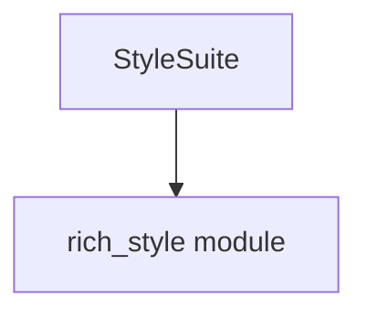

# `style_handling` Module Documentation

<!-- DIAGRAM_JSON
{
    "direction": "TD",
    "nodes": [
        {"id": "style_suite", "label": "StyleSuite", "type": "component", "link": null},
        {"id": "rich_style", "label": "rich_style module", "type": "external", "link": "rich_style.md"}
    ],
    "edges": [
        {"source": "style_suite", "target": "rich_style"}
    ],
    "groups": []
}
-->

## 1. Introduction

The `style_handling` module is a crucial component within the `benchmarks` suite, specifically designed to benchmark the performance and integrity of styling functionalities in the `rich` library. It focuses on evaluating the `rich_style` module's capabilities.

## 2. Module Purpose and Core Functionality

The primary purpose of the `style_handling` module is to provide a dedicated benchmarking suite for `rich.style` operations. Its core component, `StyleSuite`, is responsible for:

*   **Performance Measurement:** Assessing the speed and efficiency of creating, combining, and applying `Style` objects.
*   **Integrity Testing:** Ensuring that style attributes are correctly handled and rendered across various scenarios.
*   **Resource Utilization:** Monitoring memory and CPU usage related to style management.

`StyleSuite` utilizes the `Style`, `StyleStack`, and other related components from the `rich_style` module to perform its tests, providing insights into potential bottlenecks or areas for optimization.

## 3. Architecture and Component Relationships

The `style_handling` module is a leaf module, containing one core component: `StyleSuite`.

*   **`StyleSuite`:** This is a benchmark suite component that contains various benchmark methods. Each method focuses on a specific aspect of style handling, such as creating new styles, combining styles, or applying styles to text segments.

`StyleSuite` directly interacts with the `rich_style` module. It instantiates and manipulates `Style` objects and potentially uses `StyleStack` for more complex styling scenarios. The `rich_color` module (see [rich_color.md](rich_color.md)) is an indirect dependency as `rich_style` itself depends on `rich_color` for defining color attributes.

## 4. How the Module Fits into the Overall System

The `style_handling` module is nested within the `benchmarks` hierarchy:

`benchmarks`
  `basic_rendering_benchmarks`
    `color_style_suite`
      `style_handling`

It forms a specific part of the `color_style_suite` (see [color_style_suite.md](color_style_suite.md)), which groups benchmarks related to color and style management. This structure allows for granular testing of different `rich` rendering aspects. By providing focused benchmarks for style handling, it contributes to maintaining the overall performance and reliability of the `rich` library's rendering capabilities. The results from this module's benchmarks can inform development decisions and identify regressions in styling performance.