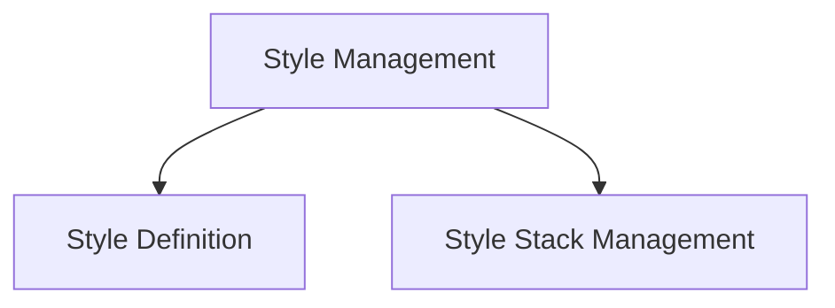

# Style Management Module

## Introduction

The `style_management` module is responsible for defining, applying, and managing various visual styles used within the Rich library for console output. It provides mechanisms for creating individual styles and managing a stack of styles for complex, nested formatting. This module is a core part of `rich_style`, ensuring consistent and flexible styling across Rich's renderables.

## Architecture Overview

The `style_management` module is composed of two primary sub-modules: `style_definition` and `style_stack_management`. `style_definition` focuses on the creation and properties of individual `Style` objects, while `style_stack_management` handles the dynamic application and removal of these styles via a `StyleStack`. These sub-modules work together to ensure consistent and flexible styling within the Rich library.

<!-- DIAGRAM_JSON
{
    "direction": "TD",
    "nodes": [
        {"id": "style_management_module", "label": "Style Management", "type": "module"},
        {"id": "style_definition", "label": "Style Definition", "type": "module", "link": "style_definition.md"},
        {"id": "style_stack_management", "label": "Style Stack Management", "type": "module", "link": "style_stack_management.md"}
    ],
    "edges": [
        {"source": "style_management_module", "target": "style_definition"},
        {"source": "style_management_module", "target": "style_stack_management"}
    ],
    "groups": []
}
-->

## High-level functionality of each sub-module

*   ### Style Definition ([style_definition.md](style_definition.md))
    This sub-module focuses on the `Style` component, which encapsulates all attributes of a visual style, such as foreground and background colors, bold, italic, underline, strike, reverse, and blink attributes. It provides a robust way to define how text should appear in the terminal.

*   ### Style Stack Management ([style_stack_management.md](style_stack_management.md))
    This sub-module manages the `StyleStack` component, providing functionality to push and pop styles, enabling the application of nested styles and ensuring correct style inheritance and precedence. It's crucial for rendering complex console outputs where different parts of the text require distinct and sometimes overlapping styles.
