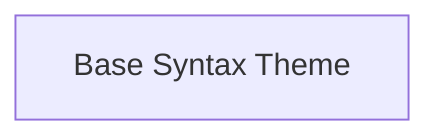

# Base Syntax Theme

Defines the foundational structure and properties for syntax highlighting themes.

## Components

This module contains 1 component(s):

- `rich_syntax.SyntaxTheme`

## Structure

---
*This documentation was auto-generated to ensure completeness.*
