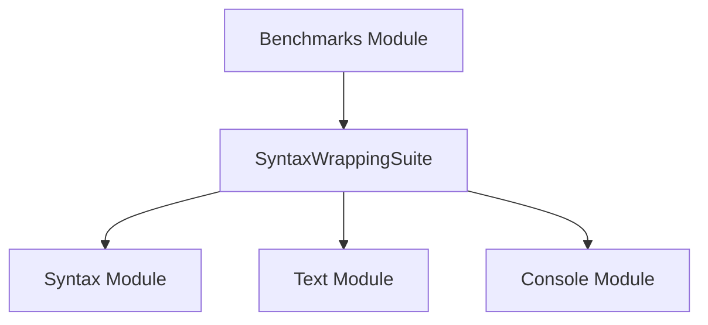

# `syntax_wrapping_benchmarks`

## Introduction

The `syntax_wrapping_benchmarks` module is a specialized benchmarking suite focused on evaluating the performance of syntax highlighting and text wrapping functionalities within the Rich library. It provides a dedicated `SyntaxWrappingSuite` for conducting performance tests related to how Rich handles syntax-aware text rendering and line breaks.

## Architecture and Component Relationships

This module contains a single core component, `SyntaxWrappingSuite`, which is responsible for defining and executing benchmarks specifically for syntax wrapping operations. It leverages components from other Rich modules to simulate real-world scenarios of syntax-highlighted code being rendered with various wrapping constraints.

<!-- DIAGRAM_JSON
{
    "direction": "TD",
    "nodes": [
        {"id": "syntax_wrapping_suite", "label": "SyntaxWrappingSuite", "type": "component", "link": null},
        {"id": "rich_syntax", "label": "Syntax Module", "type": "external", "link": "rich_syntax.md"},
        {"id": "rich_text", "label": "Text Module", "type": "external", "link": "rich_text.md"},
        {"id": "rich_console", "label": "Console Module", "type": "external", "link": "rich_console.md"},
        {"id": "benchmarks", "label": "Benchmarks Module", "type": "external", "link": "benchmarks.md"}
    ],
    "edges": [
        {"source": "syntax_wrapping_suite", "target": "rich_syntax"},
        {"source": "syntax_wrapping_suite", "target": "rich_text"},
        {"source": "syntax_wrapping_suite", "target": "rich_console"},
        {"source": "benchmarks", "target": "syntax_wrapping_suite"}
    ],
    "groups": []
}
-->

## How the Module Fits into the Overall System

The `syntax_wrapping_benchmarks` module is an integral part of the broader [benchmarks.md](benchmarks.md) system, specifically residing within the [complex_rendering_benchmarks.md](complex_rendering_benchmarks.md) suite. Its primary role is to provide detailed performance insights into the `Syntax` and `Text` rendering capabilities of Rich, particularly concerning how efficiently text is wrapped when syntax highlighting is applied.

By isolating and benchmarking these specific aspects, developers can identify performance bottlenecks and optimize the rendering pipeline for scenarios involving large amounts of syntax-highlighted code. This module ensures that changes to the core rendering engine or syntax highlighting logic do not adversely impact performance in complex wrapping situations.

It depends on:
- `rich_syntax`: For applying syntax highlighting to code snippets.
- `rich_text`: For text manipulation, styling, and word wrapping functionalities.
- `rich_console`: For console rendering and output measurement during benchmarks.

This module contributes to the overall stability and performance of the Rich library by continuously validating the efficiency of critical rendering paths.