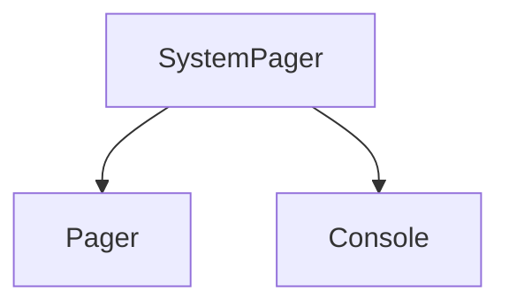

# `system_pager_component` Module Documentation

## Introduction

The `system_pager_component` module provides the `SystemPager` class, a specialized pager implementation designed to leverage the underlying operating system's native pager (e.g., `less` on Unix-like systems, `more` on Windows). This module ensures that large amounts of terminal output can be viewed efficiently and interactively by the user, consistent with their system's configuration.

## Architecture and Core Components

The `system_pager_component` module primarily consists of the `SystemPager` class. This class acts as an interface to external system pagers, allowing Rich applications to pipe their output through these tools. It inherits functionality from the more general `Pager` class found in the `rich_pager` module and interacts with the `Console` for output rendering.

### `SystemPager`

The `SystemPager` class is responsible for:
*   Detecting the availability and preferred system pager on the host operating system.
*   Spawning a subprocess to run the system pager.
*   Redirecting the Rich application's output to the standard input of the system pager process.
*   Handling signals and process management to ensure graceful termination.

## Module Relationships

The `system_pager_component` module is an integral part of Rich's terminal output handling, especially for scenarios involving extensive output that would otherwise scroll off the screen. It builds upon the foundational `Pager` abstraction and relies on the `Console` for its rendering capabilities.

<!-- DIAGRAM_JSON
{
    "direction": "TD",
    "nodes": [
        {"id": "system_pager", "label": "SystemPager", "type": "component", "link": null},
        {"id": "pager", "label": "Pager", "type": "external", "link": "rich_pager.md"},
        {"id": "console", "label": "Console", "type": "external", "link": "rich_console.md"}
    ],
    "edges": [
        {"source": "system_pager", "target": "pager"},
        {"source": "system_pager", "target": "console"}
    ],
    "groups": []
}
-->

### Dependencies:

*   [`rich_pager`](rich_pager.md): The `SystemPager` class likely extends or utilizes the base `Pager` class from this module, providing the core interface for pagers.
*   [`rich_console`](rich_console.md): The `SystemPager` interacts with the `Console` to capture and pipe output. The `Console` is responsible for the actual rendering of Rich's displayable content.
