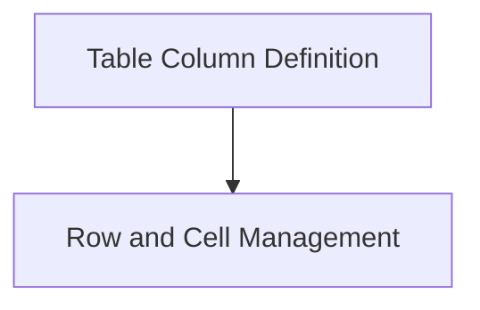

# Table Structure Module

The `table_structure` module is responsible for defining the fundamental building blocks of tables in the Rich library. It provides classes for representing columns, rows, and individual cells, which are then used by the `table_renderer` module to construct and render complex tabular data.

## Architecture Overview

The `table_structure` module is composed of two primary sub-modules: `column_definition` and `row_and_cell_management`. These sub-modules encapsulate the logic for creating and managing the structural elements of a table.

## High-Level Functionality

- **[Table Column Definition](column_definition.md):** This sub-module focuses on defining the properties and behavior of individual columns within a table. It specifies attributes such as width, alignment, and styling.
- **[Row and Cell Management](row_and_cell_management.md):** This sub-module manages the creation and organization of table rows and the individual cells contained within them. It handles how data is structured horizontally and vertically in a table.

<!-- DIAGRAM_JSON
{
    "direction": "TD",
    "nodes": [
        {"id": "column_definition", "label": "Table Column Definition", "type": "module", "link": "column_definition.md"},
        {"id": "row_and_cell_management", "label": "Row and Cell Management", "type": "module", "link": "row_and_cell_management.md"}
    ],
    "edges": [
        {"source": "column_definition", "target": "row_and_cell_management"}
    ],
    "groups": []
}
-->

