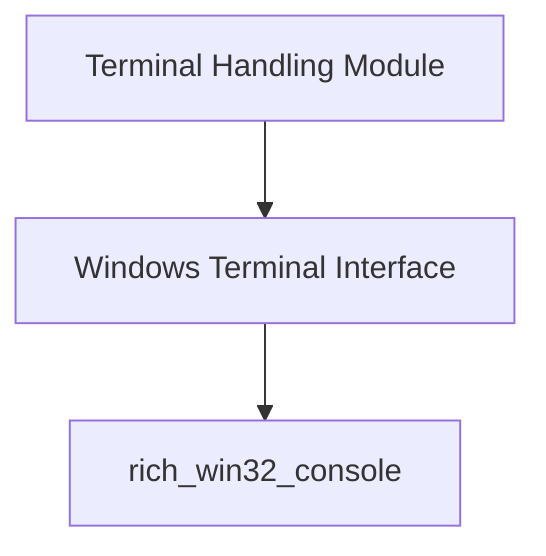

# Terminal Handling Module

## Introduction

The `terminal_handling` module provides essential functionalities for interacting with and managing terminal environments, particularly focusing on Windows-specific terminal operations. It acts as an abstraction layer to normalize terminal behavior across different platforms, ensuring consistent rendering and input handling for Rich applications.

## Architecture

The `terminal_handling` module is structured to encapsulate platform-specific terminal interactions, offering a unified interface for higher-level Rich components. It primarily interfaces with the `rich_win32_console` module for Windows-specific console features.

<!-- DIAGRAM_JSON
{
    "direction": "TD",
    "nodes": [
        {"id": "terminal_handling", "label": "Terminal Handling Module", "type": "module"},
        {"id": "windows_terminal_interface", "label": "Windows Terminal Interface", "type": "module", "link": "windows_terminal_interface.md"},
        {"id": "rich_win32_console_ext", "label": "rich_win32_console", "type": "external", "link": "rich_win32_console.md"}
    ],
    "edges": [
        {"source": "terminal_handling", "target": "windows_terminal_interface"},
        {"source": "windows_terminal_interface", "target": "rich_win32_console_ext"}
    ],
    "groups": []
}
-->

## Sub-modules

### [Windows Terminal Interface](windows_terminal_interface.md)

This sub-module (`windows_terminal_interface`) is responsible for providing an interface for interacting with legacy Windows terminals and managing coordinate systems. It abstracts away the complexities of direct Windows API calls, offering a consistent way to control terminal behavior.
