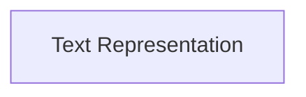

# text_and_span Module Documentation

The `text_and_span` module provides the fundamental building blocks for representing and manipulating styled text within the Rich library. It defines the `Text` class for handling text content and the `Span` class for applying styling to specific ranges within that text. This module is crucial for rendering rich output to the terminal, enabling features like syntax highlighting, colored text, and various text styles.

## Architecture Overview

The `text_and_span` module is straightforward, focusing on two core components that work in conjunction. The `Text` class aggregates `Span` objects to describe its visual appearance, allowing for fine-grained control over text styling.

<!-- DIAGRAM_JSON
{
    "direction": "TD",
    "nodes": [
        {"id": "text_representation", "label": "Text Representation", "type": "module", "link": "text_representation.md"}
    ],
    "edges": [],
    "groups": []
}
-->

## High-level Functionality

The `text_and_span` module is composed of the following sub-module:

-   **Text Representation (`text_representation.md`):** This sub-module defines the `Text` class for managing mutable styled text and the `Span` class for marking text segments with styles. It forms the core mechanism for Rich to display complex styled output.