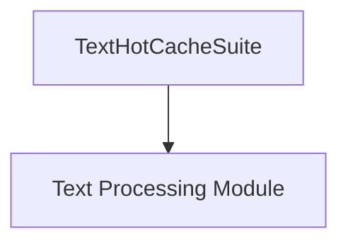

# text_cache Module Documentation

## Introduction
The `text_cache` module is a crucial component within the `benchmarks` suite, specifically focusing on evaluating the performance of text caching mechanisms. It provides a benchmark suite, `TextHotCacheSuite`, designed to measure the efficiency and effectiveness of caching frequently accessed text data in the `rich` library's rendering pipeline.

## Architecture and Component Relationships

The `text_cache` module is a leaf module, containing the `TextHotCacheSuite` which directly assesses the performance of text caching. This suite interacts with core text rendering and processing components to simulate and measure caching scenarios.

<!-- DIAGRAM_JSON
{
    "direction": "TD",
    "nodes": [
        {"id": "TextHotCacheSuite", "label": "TextHotCacheSuite", "type": "component", "link": null},
        {"id": "text_processing", "label": "Text Processing Module", "type": "external", "link": "text_processing.md"}
    ],
    "edges": [
        {"source": "TextHotCacheSuite", "target": "text_processing"}
    ],
    "groups": []
}
-->

### Core Components

#### TextHotCacheSuite
The `TextHotCacheSuite` is a benchmark suite responsible for:
-   **Evaluating Text Caching**: It measures the performance gains or overheads associated with the `rich` library's internal text caching mechanisms. This includes scenarios where text segments are repeatedly rendered.
-   **Simulating Hot Cache Scenarios**: The suite is designed to create "hot cache" conditions, where the same text data is accessed multiple times to assess the efficiency of the cache in reducing re-computation or re-rendering.
-   **Integration with Text Processing**: It relies on underlying text processing functionalities, likely provided by components within the [text_processing module](text_processing.md), to perform rendering operations that are then subjected to caching tests.

## How the Module Fits into the Overall System
The `text_cache` module is part of the `benchmarks` system, specifically within the `basic_rendering_benchmarks` and `text_rendering_suite`. Its primary role is to provide empirical data on the performance of text caching. This data is critical for:
-   **Performance Optimization**: Identifying bottlenecks and validating improvements in the `rich` library's text rendering pipeline, particularly concerning caching.
-   **System Reliability**: Ensuring that caching mechanisms perform as expected under various load conditions, contributing to the overall stability and responsiveness of applications using `rich`.
-   **Developer Insights**: Offering developers insights into how different text processing and rendering operations are affected by caching, guiding better usage patterns and configurations.

It directly contributes to understanding the efficiency of `rich` when dealing with repetitive text content, ensuring that the library remains fast and performant.
