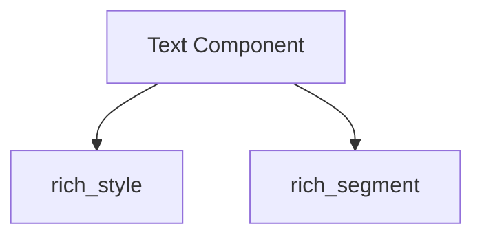

# text_object Module Documentation

## Introduction

The `text_object` module defines the core `Text` component, which is fundamental for representing and manipulating rich text within the system. It allows for the creation of text with various styles, colors, and formatting, serving as a foundational element for rendering rich content to the terminal.

## Core Functionality

The `Text` component is a versatile class that encapsulates a string along with associated style information. It provides methods for:

*   **Styling**: Applying colors, bolding, italics, and other text styles.
*   **Manipulation**: Appending, prepending, and inserting text.
*   **Rendering**: Converting the rich text into a sequence of `Segment` objects, which are then used by the `Console` for display.
*   **Splitting and Joining**: Operations to divide and combine text objects while preserving styling.

This module is a leaf module within the `rich_text` hierarchy, focusing solely on the `Text` component itself, while relying on other modules for style definition and segment generation.

## Architecture and Component Relationships

The `text_object` module primarily exposes the `Text` component. Its functionality is deeply integrated with the `rich_style` module for style management and the `rich_segment` module for breaking text into renderable segments.

<!-- DIAGRAM_JSON
{
    "direction": "TD",
    "nodes": [
        {"id": "text_component", "label": "Text Component", "type": "component", "link": null},
        {"id": "style_module", "label": "rich_style", "type": "external", "link": "rich_style.md"},
        {"id": "segment_module", "label": "rich_segment", "type": "external", "link": "rich_segment.md"}
    ],
    "edges": [
        {"source": "text_component", "target": "style_module"},
        {"source": "text_component", "target": "segment_module"}
    ],
    "groups": []
}
-->

## How the Module Fits into the Overall System

The `text_object` module, through its `Text` component, is a cornerstone for all rich text rendering. Almost any output displayed by the `Console` will, at some point, involve `Text` objects. It is used extensively by:

*   **`rich_console`**: For rendering any user-provided content.
*   **`rich_syntax`**: For highlighted code.
*   **`rich_markdown`**: For rendering markdown elements.
*   **`rich_pretty`**: For pretty-printing Python objects.
*   **`rich_table`**: For displaying tabular data.

It provides the fundamental building block for creating visually rich and formatted output, ensuring consistency and efficient handling of text across the entire Rich library. For more details on styling, refer to the [rich_style.md](rich_style.md) documentation. For details on how text is broken down into renderable units, see [rich_segment.md](rich_segment.md).