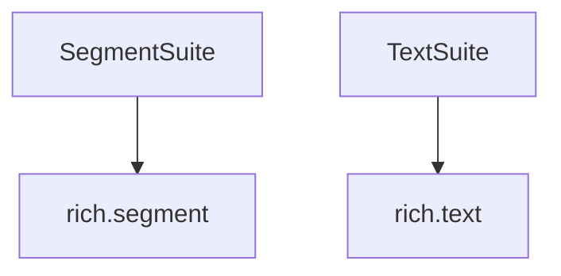

# `text_processing` Module Documentation

## Introduction

The `text_processing` module serves as a critical component within the benchmarking suite, specifically focusing on the performance aspects of text segmentation and rich text rendering. It provides dedicated benchmark suites for evaluating the efficiency of `rich.segment.Segment` and `rich.text.Text` functionalities, ensuring that core text handling operations maintain optimal performance.

## Purpose and Core Functionality

The primary purpose of the `text_processing` module is to provide granular performance benchmarks for foundational text rendering elements within the `rich` library. It encapsulates two core benchmark suites:

*   **`SegmentSuite`**: This suite is dedicated to benchmarking operations related to `rich.segment.Segment` objects. It measures the performance of creating, manipulating, and rendering individual text segments, which are the atomic units of rich text.
*   **`TextSuite`**: This suite focuses on benchmarking the `rich.text.Text` class, which represents a sequence of styled text. It evaluates the performance of operations such as text creation, styling, concatenation, and various rendering scenarios involving complex text structures.

By isolating these benchmarks, the `text_processing` module helps identify performance bottlenecks and regressions in text processing pipelines, contributing to the overall stability and efficiency of the `rich` library.

## Architecture and Component Relationships

The `text_processing` module is a leaf module within the benchmarking hierarchy, directly interacting with the core `rich` library components it evaluates.

<!-- DIAGRAM_JSON
{
    "direction": "TD",
    "nodes": [
        {"id": "segment_suite", "label": "SegmentSuite", "type": "component", "link": null},
        {"id": "text_suite", "label": "TextSuite", "type": "component", "link": null},
        {"id": "rich_segment", "label": "rich.segment", "type": "external", "link": "rich_segment.md"},
        {"id": "rich_text", "label": "rich.text", "type": "external", "link": "rich_text.md"}
    ],
    "edges": [
        {"source": "segment_suite", "target": "rich_segment"},
        {"source": "text_suite", "target": "rich_text"}
    ],
    "groups": []
}
-->

**Internal Components:**

*   **`SegmentSuite`**: A benchmark suite designed to test the performance of the [rich.segment](rich_segment.md) module's functionalities.
*   **`TextSuite`**: A benchmark suite designed to test the performance of the [rich.text](rich_text.md) module's functionalities.

**External Dependencies:**

*   **`rich.segment`**: Provides the fundamental `Segment` object for individual text parts. The `SegmentSuite` directly benchmarks operations on this module.
*   **`rich.text`**: Offers the `Text` object for comprehensive rich text handling. The `TextSuite` focuses on benchmarking various operations of this module.

## How the Module Fits into the Overall System

The `text_processing` module is situated within the `benchmarks` system, specifically under `benchmarks/basic_rendering_benchmarks/text_rendering_suite`. It forms a crucial part of the quality assurance and performance monitoring pipeline for the `rich` library's rendering capabilities.

Its direct parent is `text_rendering_suite`, which groups together benchmarks related to text rendering. By providing specific benchmarks for `Segment` and `Text` objects, `text_processing` contributes detailed performance insights that inform optimizations and ensure the efficiency of all higher-level text rendering features. It ensures that the basic building blocks of rich text are performant, which is essential for the snappy and responsive output of the entire `rich` library.