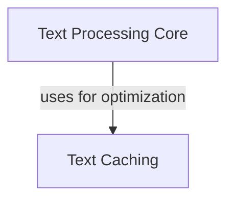

# text_rendering_suite Module Documentation

## Introduction

The `text_rendering_suite` module is a core component within the `benchmarks.basic_rendering_benchmarks` suite, focusing on the fundamental aspects of text processing, segmentation, and efficient rendering through caching mechanisms. It provides the foundational tools for handling text content before it undergoes styling, coloring, or more complex rendering operations.

## Architecture Overview

The `text_rendering_suite` module is structured into two main sub-modules:

*   **Text Processing Core (`text_processing`)**: Deals with the fundamental segmentation and rendering of text.
*   **Text Caching (`text_cache`)**: Optimizes performance by caching rendered text segments.

These sub-modules work together to ensure efficient and accurate text presentation. The text processing core prepares text, and the caching mechanism stores frequently used segments to reduce redundant processing.

<!-- DIAGRAM_JSON
{
    "direction": "TD",
    "nodes": [
        {"id": "text_processing", "label": "Text Processing Core", "type": "module", "link": "text_processing.md"},
        {"id": "text_cache", "label": "Text Caching", "type": "module", "link": "text_cache.md"}
    ],
    "edges": [
        {"source": "text_processing", "target": "text_cache", "label": "uses for optimization"}
    ],
    "groups": []
}
-->

## Sub-modules

### Text Processing Core

The `text_processing` sub-module is responsible for the core mechanics of text segmentation and initial rendering. It encompasses components like `SegmentSuite` and `TextSuite`, which are critical for breaking down text into manageable segments and preparing them for display.

For more detailed information, refer to the [Text Processing Core documentation](text_processing.md).

### Text Caching

The `text_cache` sub-module, leveraging components like `TextHotCacheSuite`, provides mechanisms to cache rendered text segments. This significantly improves performance by reducing the need to re-process text that has already been rendered, making it especially useful in scenarios with repetitive text elements.

For more detailed information, refer to the [Text Caching documentation](text_cache.md).
