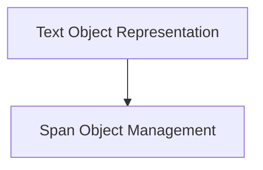

# Text Representation Module

The `text_representation` module is responsible for defining and managing the core `Text` object and its associated `Span` objects within the Rich library. It provides the fundamental building blocks for rich text rendering, allowing for styled text with various attributes like color, bold, italic, etc.

## Architecture Overview

The module is composed of two primary sub-modules:

*   **Text Object Representation** ([text_object.md](text_object.md)): Manages the `Text` component, which is the mutable sequence of characters and styles.
*   **Span Object Management** ([span_object.md](span_object.md)): Handles the `Span` component, defining a specific style over a range of text within a `Text` object.

These sub-modules work in conjunction to enable flexible and powerful text styling capabilities.

<!-- DIAGRAM_JSON
{
    "direction": "TD",
    "nodes": [
        {"id": "text_object", "label": "Text Object Representation", "type": "module", "link": "text_object.md"},
        {"id": "span_object", "label": "Span Object Management", "type": "module", "link": "span_object.md"}
    ],
    "edges": [
        {"source": "text_object", "target": "span_object"}
    ],
    "groups": []
}
-->

