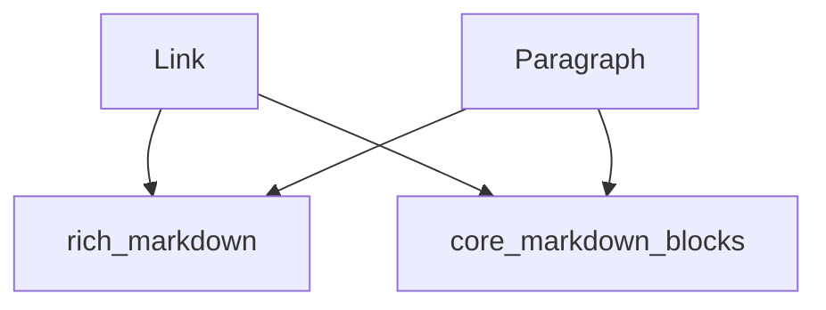

# textual_markdown_blocks Module

## Introduction

The `textual_markdown_blocks` module, a sub-module of `rich_markdown`, provides the core components for handling basic textual elements within Markdown documents, specifically `Link` and `Paragraph`. These components are essential for representing hyperlinks and standard text blocks, forming the fundamental building blocks of most Markdown content.

## Components

### Link

The `Link` component represents a hyperlink in Markdown. It encapsulates the text displayed to the user and the URL it points to. This component is crucial for rendering interactive and navigable content within rich text displays.

### Paragraph

The `Paragraph` component represents a standard block of text. It is the most common element for displaying general textual content in Markdown. This component handles the rendering of contiguous lines of text, applying appropriate styling and formatting as defined by the overall Markdown context.

## Architecture Diagram

<!-- DIAGRAM_JSON
{
    "direction": "TD",
    "nodes": [
        {"id": "link", "label": "Link", "type": "component", "link": null},
        {"id": "paragraph", "label": "Paragraph", "type": "component", "link": null},
        {"id": "rich_markdown", "label": "rich_markdown", "type": "external", "link": "rich_markdown.md"},
        {"id": "core_markdown_blocks", "label": "core_markdown_blocks", "type": "external", "link": "core_markdown_blocks.md"}
    ],
    "edges": [
        {"source": "link", "target": "rich_markdown"},
        {"source": "paragraph", "target": "rich_markdown"},
        {"source": "link", "target": "core_markdown_blocks"},
        {"source": "paragraph", "target": "core_markdown_blocks"}
    ],
    "groups": []
}
-->
