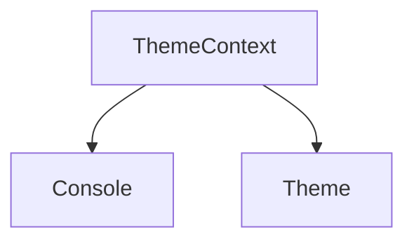

# `theme_context` Module Documentation

## Introduction

The `theme_context` module, a sub-module of `rich_console.rendering_and_hooks.console_contexts`, provides the `ThemeContext` class, which is crucial for managing and applying themes within Rich applications. It allows for the dynamic application of styles and colors defined in a `Theme` object, ensuring consistent rendering across different parts of a Rich application.

## Architecture and Component Relationships

The `ThemeContext` is a context manager that temporarily sets the theme for console rendering. It interacts primarily with the `rich_console.Console` and `rich_theme.Theme` modules. When a `ThemeContext` is entered, the `Console` instance uses the specified theme for all subsequent rendering operations until the context is exited.

<!-- DIAGRAM_JSON
{
    "direction": "TD",
    "nodes": [
        {"id": "theme_context", "label": "ThemeContext", "type": "component", "link": null},
        {"id": "console", "label": "Console", "type": "external", "link": "rich_console.md"},
        {"id": "theme", "label": "Theme", "type": "external", "link": "rich_theme.md"}
    ],
    "edges": [
        {"source": "theme_context", "target": "console"},
        {"source": "theme_context", "target": "theme"}
    ],
    "groups": []
}
-->



## Module Integration

The `ThemeContext` plays a vital role in integrating custom styling and branding into Rich applications. It allows developers to define a `Theme` once and apply it easily to specific sections of their output, ensuring a consistent look and feel without repetitive style declarations. This module is frequently used in scenarios where different parts of an application require distinct visual themes or when user-configurable themes are supported.

### Usage Example

```python
from rich.console import Console, ThemeContext
from rich.theme import Theme
from rich.text import Text

custom_theme = Theme({
    "info": "dim cyan",
    "warning": "magenta",
    "danger": "bold red"
})

console = Console(theme=custom_theme)

console.print(Text("This is an info message.", style="info"))

with console.use_theme(Theme({"info": "green"})):
    console.print(Text("This is an overridden info message.", style="info"))

console.print(Text("This is another info message, back to original theme.", style="info"))
```