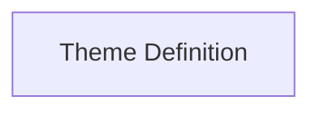

# Theme Definition

Defines the structure and properties of a Rich theme, including styles and colors.

## Components

This module contains 1 component(s):

- `Theme`

## Structure

---
*This documentation was auto-generated to ensure completeness.*
