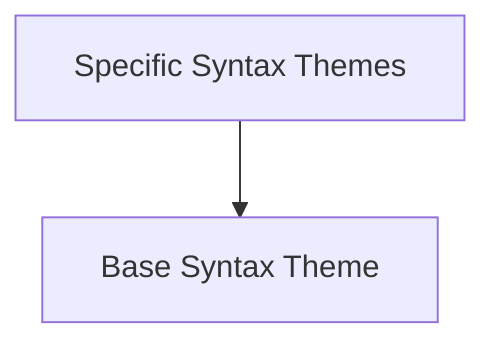

# Theme Definitions Module

The `theme_definitions` module in Rich is responsible for defining and managing various syntax highlighting themes. It provides the foundational classes for creating themes and specific implementations for integrating with Pygments and handling ANSI color codes.

## Architecture Overview

The module is structured around a base syntax theme definition and specialized themes that build upon it. The following diagram illustrates the relationships between these components:

<!-- DIAGRAM_JSON
{
    "direction": "TD",
    "nodes": [
        {"id": "syntax_theme_base", "label": "Base Syntax Theme", "type": "module", "link": "syntax_theme_base.md"},
        {"id": "specific_syntax_themes", "label": "Specific Syntax Themes", "type": "module", "link": "specific_syntax_themes.md"}
    ],
    "edges": [
        {"source": "specific_syntax_themes", "target": "syntax_theme_base"}
    ],
    "groups": []
}
-->

## Sub-modules

### [Base Syntax Theme](syntax_theme_base.md)
This sub-module ([`syntax_theme_base.md`](syntax_theme_base.md)) defines the fundamental `SyntaxTheme` class, which serves as the blueprint for all syntax highlighting themes within Rich. It outlines the essential properties and methods that any theme implementation should adhere to.

### [Specific Syntax Themes](specific_syntax_themes.md)
This sub-module ([`specific_syntax_themes.md`](specific_syntax_themes.md)) provides concrete implementations of syntax themes, including `PygmentsSyntaxTheme` for integrating with the popular Pygments highlighting library and `ANSISyntaxTheme` for handling basic ANSI color codes. These themes extend the base `SyntaxTheme` to offer practical highlighting capabilities.
