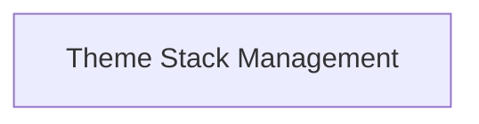

# Theme Stack Management

Manages a stack of active themes, allowing for dynamic theme application and inheritance.

## Components

This module contains 1 component(s):

- `ThemeStack`

## Structure

---
*This documentation was auto-generated to ensure completeness.*
