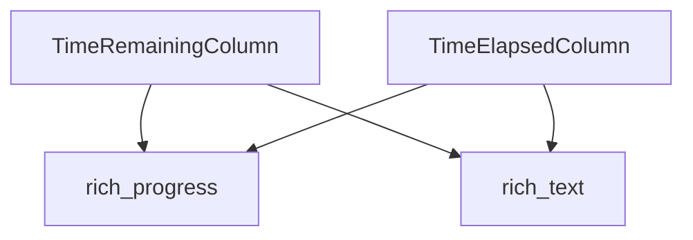

# `time_display_columns` Module Documentation

## Introduction

The `time_display_columns` module provides specialized `ProgressColumn` implementations for displaying time-related information within Rich's progress bars. It includes columns to show the time elapsed since a task started and the estimated time remaining until its completion. These columns are essential for providing users with real-time feedback on the progress of long-running operations.

## Architecture and Core Functionality

The `time_display_columns` module is a sub-module of `rich_progress.progress_columns.duration_columns` and primarily encapsulates two core components:

*   **`TimeRemainingColumn`**: This column calculates and displays the estimated time left for a given progress task to complete. It relies on the progress tracking data provided by the `rich_progress` module.
*   **`TimeElapsedColumn`**: This column shows the total time that has passed since a progress task was initiated. Similar to `TimeRemainingColumn`, it draws its data from the `rich_progress` module.

Both components inherit from `ProgressColumn` (defined in `rich_progress`) and utilize `Text` objects (from `rich_text`) for their rendering, allowing for rich formatting and styling of the displayed time information.

## Module Relationships

This module integrates directly into the `rich_progress` system, specifically within the column display mechanism of the `Progress` bar. It consumes task state information from the `Progress` object and formats the output using `rich_text` components.

<!-- DIAGRAM_JSON
{
    "direction": "TD",
    "nodes": [
        {"id": "time_remaining_column", "label": "TimeRemainingColumn", "type": "component", "link": null},
        {"id": "time_elapsed_column", "label": "TimeElapsedColumn", "type": "component", "link": null},
        {"id": "rich_progress", "label": "rich_progress", "type": "external", "link": "rich_progress.md"},
        {"id": "rich_text", "label": "rich_text", "type": "external", "link": "rich_text.md"}
    ],
    "edges": [
        {"source": "time_remaining_column", "target": "rich_progress"},
        {"source": "time_remaining_column", "target": "rich_text"},
        {"source": "time_elapsed_column", "target": "rich_progress"},
        {"source": "time_elapsed_column", "target": "rich_text"}
    ],
    "groups": []
}
-->
