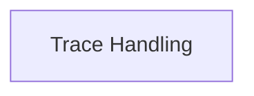

# Trace Handling

Manages and represents the execution trace within a traceback.

## Components

This module contains 1 component(s):

- `Trace`

## Structure

---
*This documentation was auto-generated to ensure completeness.*
