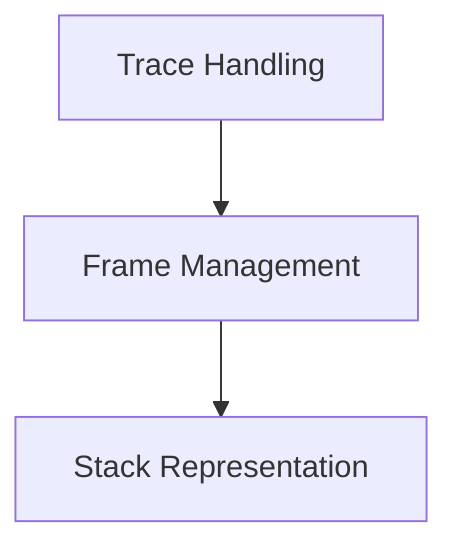

# Traceback Elements Module

The `traceback_elements` module is a crucial component within the `rich_traceback` system, responsible for defining the core data structures that represent an execution traceback. It provides the building blocks for capturing and organizing information about exceptions and their call stacks, enabling `rich` to render detailed and aesthetically pleasing tracebacks.

## Architecture

The module is structured into three main sub-modules, each focusing on a specific aspect of traceback representation:

<!-- DIAGRAM_JSON
{
    "direction": "TD",
    "nodes": [
        {"id": "trace_handling", "label": "Trace Handling", "type": "module", "link": "trace_handling.md"},
        {"id": "frame_management", "label": "Frame Management", "type": "module", "link": "frame_management.md"},
        {"id": "stack_representation", "label": "Stack Representation", "type": "module", "link": "stack_representation.md"}
    ],
    "edges": [
        {"source": "trace_handling", "target": "frame_management"},
        {"source": "frame_management", "target": "stack_representation"}
    ],
    "groups": []
}
-->

## Sub-modules

### [Trace Handling](trace_handling.md)
This sub-module is responsible for managing and representing the execution trace within a traceback. It encapsulates the sequence of events and calls that lead to an exception.

### [Frame Management](frame_management.md)
This sub-module handles individual stack frames, including their code context and variables. It provides a detailed view of the execution state at each point in the call stack.

### [Stack Representation](stack_representation.md)
This sub-module manages the collection of frames in a call stack for display. It organizes the individual frames into a coherent representation of the full call stack.