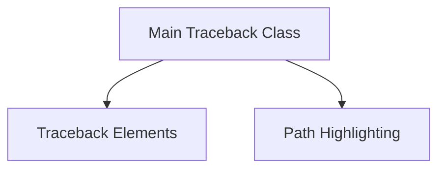

# Traceback Generation Module

The `traceback_generation` module is a core component within the `rich` library, responsible for processing raw exception information and transforming it into human-readable and visually enhanced traceback representations. It defines the fundamental structures and the main class for rendering detailed and styled tracebacks, crucial for debugging and error reporting.

This module works in conjunction with the broader `rich_traceback` module, providing the specific logic for extracting and structuring traceback data. It also interfaces with sibling modules like `path_highlighting` for enhancing the visual presentation of file paths within tracebacks.

## Architecture

The `traceback_generation` module is composed of two main sub-modules: `traceback_elements` and `traceback_main`. These modules collaborate to capture, structure, and render traceback information effectively.

<!-- DIAGRAM_JSON
{
    "direction": "TD",
    "nodes": [
        {"id": "traceback_main", "label": "Main Traceback Class", "type": "module", "link": "traceback_main.md"},
        {"id": "traceback_elements", "label": "Traceback Elements", "type": "module", "link": "traceback_elements.md"},
        {"id": "path_highlighting", "label": "Path Highlighting", "type": "module", "link": "path_highlighting.md", "tooltip": "View Path Highlighting Module"}
    ],
    "edges": [
        {"source": "traceback_main", "target": "traceback_elements"},
        {"source": "traceback_main", "target": "path_highlighting"}
    ],
    "groups": []
}
-->

## Sub-modules

### [Traceback Elements](traceback_elements.md)
This sub-module defines the fundamental data structures that represent a call stack. It includes `Trace` for the overall exception trace, `Frame` for individual stack frames, and `Stack` for a collection of frames. These components are essential for capturing the detailed execution path leading to an error.

### [Main Traceback Class](traceback_main.md)
The `traceback_main` sub-module encapsulates the `Traceback` class, which serves as the primary interface for generating and rendering formatted tracebacks. This class orchestrates the collection of traceback elements and applies various formatting and styling options to produce a rich and informative output.

## Integration with other Modules

The `traceback_generation` module is tightly integrated with its parent module, `rich_traceback`, which provides a higher-level abstraction for traceback handling. It also interacts with the [Path Highlighting module](path_highlighting.md) for visually distinguishing file paths within the traceback output.