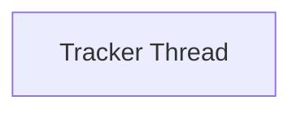

# Tracker Thread

Manages a dedicated thread for tracking and updating progress information.

## Components

This module contains 1 component(s):

- `_TrackThread`

## Structure

---
*This documentation was auto-generated to ensure completeness.*
