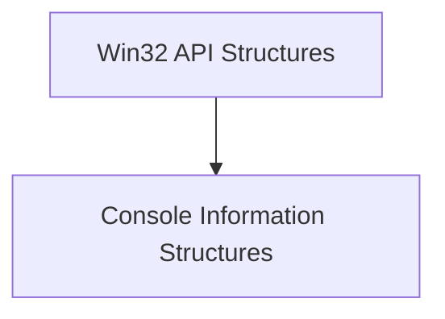

# Win32 API Structures Documentation

## Introduction

The `win32_api_structures` module provides Pythonic representations of essential Windows API data structures. These structures are crucial for directly interacting with the Windows console, enabling detailed control and retrieval of information about its state, such as cursor position and screen buffer characteristics.

## Architecture Overview

This module primarily serves as a foundational layer, defining the necessary data structures that other modules, particularly those involved in Windows console handling (e.g., `rich_win32_console`), utilize to interface with the native Windows API. It encapsulates the complexities of these structures, allowing for safer and more convenient manipulation within Python applications.

<!-- DIAGRAM_JSON
{
    "direction": "TD",
    "nodes": [
        {"id": "console_info_structures", "label": "Console Information Structures", "type": "module", "link": "console_info_structures.md"}
    ],
    "edges": [],
    "groups": []
}
-->

## Sub-modules

### Console Information Structures

The `console_info_structures` sub-module defines critical data structures like `CONSOLE_CURSOR_INFO` and `CONSOLE_SCREEN_BUFFER_INFO`. These are used to query and modify the state of the Windows console's cursor and screen buffer. For more details, refer to the [Console Information Structures documentation](console_info_structures.md).
