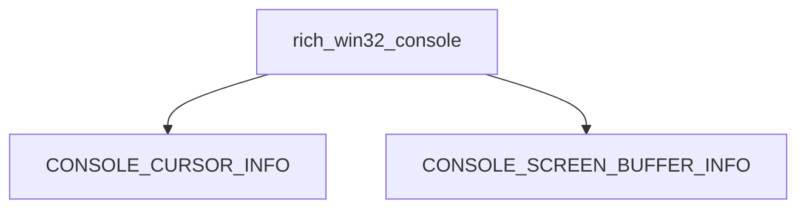

# `windows_console_info`

The `windows_console_info` module defines critical data structures used for interacting with the Windows Console API. Specifically, it encapsulates the `CONSOLE_CURSOR_INFO` and `CONSOLE_SCREEN_BUFFER_INFO` structures, which are essential for querying and manipulating the console's cursor appearance and screen buffer properties, respectively.

## Purpose and Core Functionality

This module serves as a foundational component for Windows-specific console operations within the larger system. It provides the Python representations of Win32 API structures, allowing other modules to pass and receive console information to and from the operating system.

*   **`CONSOLE_CURSOR_INFO`**: This structure defines the appearance of the console cursor. It typically includes fields for the cursor's size (thickness) and its visibility.
*   **`CONSOLE_SCREEN_BUFFER_INFO`**: This comprehensive structure contains detailed information about a console screen buffer. It includes data such as the screen buffer size, the current cursor position, the attributes of characters written to the console, the visible window area, and the maximum window size.

## Architecture and Component Relationships

As a leaf module, `windows_console_info` primarily exports its core data structures for use by higher-level modules. It is part of a hierarchy under `rich_win32_console`, specifically within the `win32_api_structures` and `console_info_structures` sub-modules, indicating its role in providing fundamental Windows API definitions.

Other modules, particularly those concerned with direct Windows console manipulation (e.g., `rich_win32_console`), will import and utilize these structures to perform tasks like setting the cursor position, changing cursor visibility, or retrieving information about the console's dimensions and character attributes.

<!-- DIAGRAM_JSON
{
    "direction": "TD",
    "nodes": [
        {"id": "console_cursor_info", "label": "CONSOLE_CURSOR_INFO", "type": "component", "link": null},
        {"id": "console_screen_buffer_info", "label": "CONSOLE_SCREEN_BUFFER_INFO", "type": "component", "link": null},
        {"id": "rich_win32_console", "label": "rich_win32_console", "type": "external", "link": "rich_win32_console.md"}
    ],
    "edges": [
        {"source": "rich_win32_console", "target": "console_cursor_info"},
        {"source": "rich_win32_console", "target": "console_screen_buffer_info"}
    ],
    "groups": []
}
-->

## How the Module Fits into the Overall System

This module is crucial for any part of the system that needs to interact directly with the Windows console at a low level. It provides the necessary data models that mirror the underlying Win32 API. For example, a console rendering engine or a module responsible for managing terminal state on Windows platforms would depend on `windows_console_info` to correctly interpret and construct API calls.

It ensures type safety and clarity when dealing with complex Windows API structures, abstracting away some of the raw ctypes complexities into more manageable Python objects. Its existence allows for robust and reliable Windows console support within the broader application, enabling features like advanced text styling, cursor manipulation, and precise terminal output management.