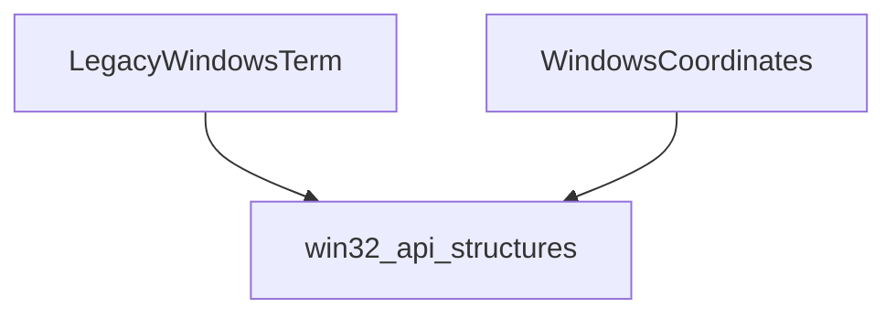

# `windows_interface_core` Module Documentation

The `windows_interface_core` module provides fundamental components for interacting with the Windows console, specifically handling legacy terminal operations and coordinate systems. It serves as a low-level interface, abstracting the complexities of the Windows API for console management. This module is a core part of the `rich_win32_console` family, offering the basic building blocks for more advanced terminal handling.

### Purpose and Core Functionality

The primary purpose of `windows_interface_core` is to encapsulate the specific functionalities required for managing the Windows console in a way that is compatible with legacy systems, while also providing utilities for screen coordinate manipulation. Its core components are:

*   `LegacyWindowsTerm`: This component likely handles direct interaction with the Windows console API, managing aspects such as cursor visibility, screen buffer manipulation, and color output in a manner consistent with older Windows environments. It provides the necessary plumbing for a `rich` application to render correctly on Windows terminals, especially where more modern virtual terminal sequences might not be fully supported.
*   `WindowsCoordinates`: This component focuses on the representation and manipulation of screen coordinates within the Windows console. It provides utilities for translating between different coordinate systems, determining cursor positions, and defining regions of the console window. This is crucial for precise rendering and interactive elements.

### Architecture and Component Relationships

The `windows_interface_core` module is a leaf module, meaning it does not have any further sub-modules. It provides essential components that are consumed by higher-level modules within the `rich_win32_console` hierarchy. It depends on `win32_api_structures` for low-level Windows API data types.

<!-- DIAGRAM_JSON
{
    "direction": "TD",
    "nodes": [
        {"id": "legacy_windows_term", "label": "LegacyWindowsTerm", "type": "component", "link": null},
        {"id": "windows_coordinates", "label": "WindowsCoordinates", "type": "component", "link": null},
        {"id": "win32_api_structures", "label": "win32_api_structures", "type": "external", "link": "win32_api_structures.md"}
    ],
    "edges": [
        {"source": "legacy_windows_term", "target": "win32_api_structures"},
        {"source": "windows_coordinates", "target": "win32_api_structures"}
    ],
    "groups": []
}
-->

### How the Module Fits into the Overall System

The `windows_interface_core` module is a foundational layer within the `rich` library's Windows compatibility stack. It provides the raw tools for interacting with the Windows console.

*   **Dependency for Terminal Handling:** The components defined here, `LegacyWindowsTerm` and `WindowsCoordinates`, are directly used by the `windows_terminal_interface` module (a parent module) to provide a more complete and abstracted interface for Windows terminal operations.
*   **Integration with `rich_win32_console`:** Ultimately, these core functionalities feed into the broader `rich_win32_console` module, which orchestrates all Windows-specific console interactions for the `rich` library. This ensures that `rich` applications can render effectively on various Windows environments, including those that might require legacy API calls.
*   **Utilizes `win32_api_structures`:** This module relies on the definitions found in [win32_api_structures](win32_api_structures.md), which provides the raw C-style structures and constants necessary to interface with the Windows API. This separation ensures that the core interface logic is clean and focused, delegating the definition of low-level data types to a dedicated module.

By centralizing these core Windows console functionalities, `windows_interface_core` ensures consistency and maintainability for the `rich` library's cross-platform compatibility.