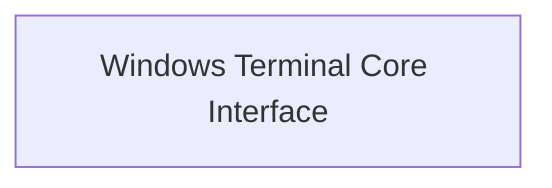

# `windows_terminal_interface` Module Documentation

## Introduction
The `windows_terminal_interface` module provides the foundational components for interacting with the Windows console, specifically focusing on legacy terminal handling and coordinate management. It serves as a bridge for rich rendering capabilities within the Windows environment.

## Architecture Overview
This module encapsulates the core logic for adapting rich content rendering to the specific behaviors and APIs of the Windows terminal.

<!-- DIAGRAM_JSON
{
    "direction": "TD",
    "nodes": [
        {"id": "windows_interface_core", "label": "Windows Terminal Core Interface", "type": "module", "link": "windows_interface_core.md"}
    ],
    "edges": [],
    "groups": []
}
-->

## Sub-modules

### Windows Terminal Core Interface (`windows_interface_core`)
This sub-module, documented in [windows_interface_core.md](windows_interface_core.md), contains the primary classes for low-level Windows terminal interactions. It defines how the system handles legacy terminal features and manages screen coordinates for accurate content placement.
