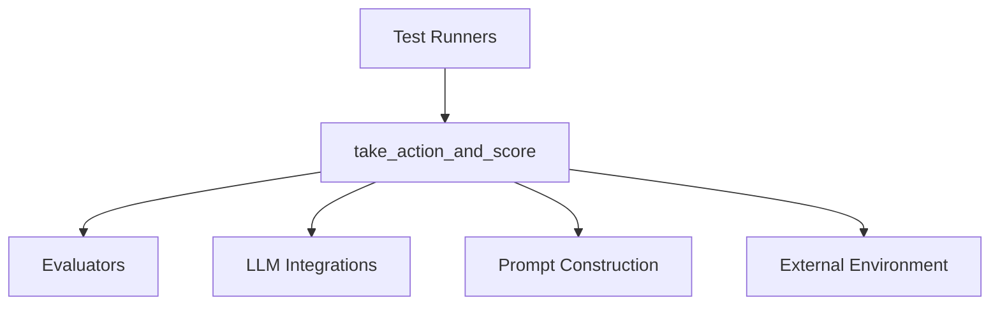

# Module: action_scoring

## Introduction
The `action_scoring` module is a critical component within the agent's execution and testing framework. Its primary responsibility is to execute a given action, observe the resulting environmental state, evaluate the success of the taken action within the current trajectory, and, if necessary, generate subsequent actions. This module is central to how an agent progresses through a task and assesses its performance.

## Core Functionality

The `action_scoring` module contains the `run.take_action_and_score` function, which orchestrates the execution and evaluation of agent actions.

### `run.take_action_and_score`

This function performs the following steps:
1.  **Action Execution**: It takes an action `a` and executes it within the environment using `env.step(a)`. This updates the environment's state and returns a new observation.
2.  **Observation Recording**: The observation (including the image and text) and the executed action are recorded and appended to `all_inputs`.
3.  **Trajectory and History Update**: The executed action and its natural language description (obtained via `get_action_description`) are added to the temporary trajectory and action history.
4.  **Stop Action Handling**: If the executed action is of `ActionTypes.STOP`, the process for generating further actions is terminated for the current branch. If the environment signals termination, a stop action is implicitly created and appended.
5.  **Trajectory Evaluation**: The current trajectory is evaluated for success using a configurable `value_function`. Currently, this supports an external evaluator like `gpt4o`, which assesses the trajectory based on screenshots, action history, current URL, last reasoning, and the overall intent.
6.  **Next Action Generation**: If the evaluated score indicates that the trajectory is not fully successful (score < 1) and further actions are permitted, the system checks for early stopping conditions. If no early stop is triggered, the `agent.next_action` method is invoked to generate a list of possible actions for the next step, considering the current trajectory, intent, and branching factor.

## Architecture and Component Relationships

The `action_scoring` module, specifically the `take_action_and_score` function, acts as a central coordinator, interacting with various parts of the system to manage action execution and evaluation.

<!-- DIAGRAM_JSON
{
    "direction": "TD",
    "nodes": [
        {"id": "take_action_and_score", "label": "take_action_and_score", "type": "component", "link": null},
        {"id": "test_runners", "label": "Test Runners", "type": "external", "link": "test_runners.md"},
        {"id": "evaluators", "label": "Evaluators", "type": "external", "link": "evaluators.md"},
        {"id": "llm_integrations", "label": "LLM Integrations", "type": "external", "link": "llm_integrations.md"},
        {"id": "prompt_construction", "label": "Prompt Construction", "type": "external", "link": "prompt_construction.md"},
        {"id": "environment", "label": "External Environment", "type": "external", "link": null}
    ],
    "edges": [
        {"source": "test_runners", "target": "take_action_and_score"},
        {"source": "take_action_and_score", "target": "evaluators"},
        {"source": "take_action_and_score", "target": "llm_integrations"},
        {"source": "take_action_and_score", "target": "prompt_construction"},
        {"source": "take_action_and_score", "target": "environment"}
    ],
    "groups": []
}
-->

### Internal Components

*   `take_action_and_score`: The main function within this module, responsible for the entire action-execution-evaluation-generation loop.

### External Dependencies

*   **[test_runners](test_runners.md)**: This module likely calls `take_action_and_score` to execute and evaluate individual actions as part of a broader testing or execution process.
*   **[evaluators](evaluators.md)**: The `value_function.evaluate_success` method is a key dependency. This function relies on the `evaluators` module to determine the success score of a given trajectory.
*   **[llm_integrations](llm_integrations.md)**: When the `value_function` is configured to use models like "gpt4o", this module interacts with large language models through the `llm_integrations` module (e.g., `llms.providers.openai_utils.agenerate_from_openai_completion`).
*   **[prompt_construction](prompt_construction.md)**: The `agent.next_action` method, which is invoked to generate subsequent actions, depends on the `prompt_construction` module to formulate appropriate prompts for the agent's decision-making process.
*   **External Environment**: The `env.step(a)` call represents an interaction with the simulated or real environment where actions are performed and observations are received.

## How the Module Fits into the Overall System

The `action_scoring` module is a fundamental part of the `execution_and_testing` framework. It is directly nested under `test_execution`, indicating its role in the operational testing and execution of agent logic.

*   **Agent Execution Loop**: It forms a core part of the agent's iterative process: act, observe, evaluate, and decide the next action.
*   **Testing and Evaluation**: By integrating with `evaluators` and `llm_integrations`, it provides the means to assess the effectiveness of an agent's actions against defined criteria or external models.
*   **Trajectory Management**: It continuously builds and updates the agent's trajectory, which is crucial for understanding the agent's path and for debugging.
*   **Action Generation**: Its ability to generate `next_actions` based on current performance is vital for exploration and achieving task goals.

In essence, `action_scoring` is the engine that drives an agent's interaction with its environment, enabling it to take steps, understand their impact, and plan future actions within the overarching `execution_and_testing` framework.