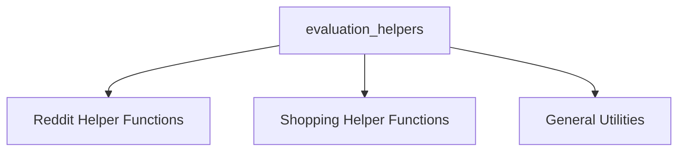

# Evaluation Helpers Module

## Introduction

The `evaluation_helpers` module provides a collection of utility functions designed to assist in various evaluation scenarios, primarily by interacting with external platforms like Reddit and a shopping website, and offering general text manipulation. These helpers simplify the process of extracting specific data points needed for test assertions and performance metrics.

## Architecture Overview

The `evaluation_helpers` module is structured into several sub-modules, each encapsulating a set of related helper functions. This modular design enhances readability, maintainability, and reusability of the evaluation logic.

<!-- DIAGRAM_JSON
{
    "direction": "TD",
    "nodes": [
        {"id": "reddit_helpers", "label": "Reddit Helper Functions", "type": "module", "link": "reddit_helpers.md"},
        {"id": "shopping_helpers", "label": "Shopping Helper Functions", "type": "module", "link": "shopping_helpers.md"},
        {"id": "general_utilities", "label": "General Utilities", "type": "module", "link": "general_utilities.md"}
    ],
    "edges": [],
    "groups": []
}
-->

## Sub-modules

This module is composed of the following sub-modules:

### Reddit Helper Functions
Provides utility functions for interacting with Reddit content, such as fetching comment details. For more details, refer to [reddit_helpers.md](reddit_helpers.md).

### Shopping Helper Functions
Offers a suite of helper functions to interact with the shopping platform, including order details and product reviews. For more details, refer to [shopping_helpers.md](shopping_helpers.md).

### General Utilities
Contains general utility functions useful across different evaluation scenarios. For more details, refer to [general_utilities.md](general_utilities.md).