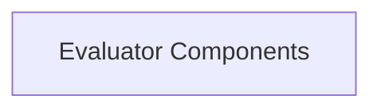

# Evaluation Logic Module

## Introduction

The `evaluation_logic` module serves as the core framework for defining and executing evaluation strategies within the system. It encapsulates the fundamental evaluators that assess the performance and correctness of agent responses across various tasks.

## Architecture Overview

The `evaluation_logic` module is designed to be modular, allowing for the easy integration of different evaluation criteria. It primarily leverages a set of specialized evaluators to determine the success of agent actions.

<!-- DIAGRAM_JSON
{
    "direction": "TD",
    "nodes": [
        {"id": "evaluator_components", "label": "Evaluator Components", "type": "module", "link": "evaluator_components.md"}
    ],
    "edges": [],
    "groups": []
}
-->

## Sub-modules

### Evaluator Components ([evaluator_components.md](evaluator_components.md))
This sub-module contains the fundamental classes for evaluating agent responses, including numeric and string-based comparisons.

## Related Modules

*   [Evaluators Module](evaluators.md): The parent module for all evaluators, providing a broader context for the evaluation components.
*   [Success Rate Calculation Module](success_rate_calculation.md): Integrates with evaluation logic to compute and report success rates based on evaluation outcomes.
*   [Execution and Testing Module](execution_and_testing.md): Utilizes the evaluation logic to test agent actions and record their performance.
*   [Evaluation Helpers Module](evaluation_helpers.md): Provides helper functions that assist in gathering data and preparing it for evaluation.
*   [LLM Integrations Module](llm_integrations.md): May interact with evaluation logic if LLM-based evaluations or prompt constructions are part of the process.
*   [Prompt Construction Module](prompt_construction.md): Relevant for understanding how prompts are constructed for agents whose responses are then subjected to this evaluation logic.
