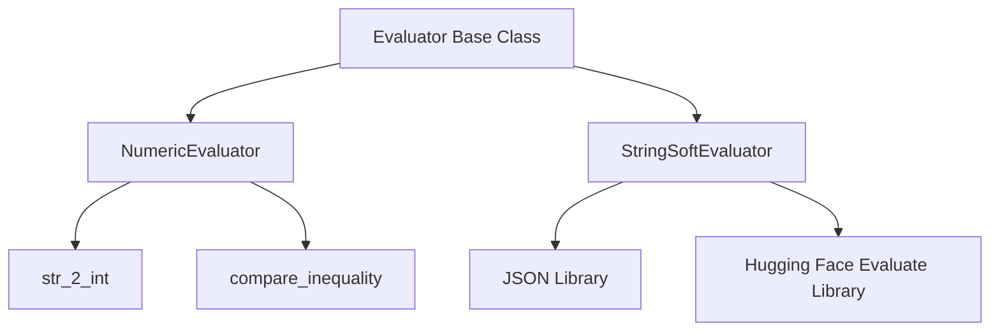

# `evaluator_components` Module Documentation

## Introduction

The `evaluator_components` module provides the core logic for evaluating agent responses, specifically focusing on numeric and string-based evaluations. It encapsulates concrete implementations of different evaluation strategies, serving as a foundational layer for assessing the correctness and quality of agent outputs.

This module is a leaf component within the larger [evaluators](evaluators.md) and [evaluation_logic](evaluation_logic.md) hierarchy, providing the specific mechanisms for determining if an agent's action or answer meets predefined criteria.

## Architecture and Component Relationships

The `evaluator_components` module contains two primary evaluators:

1.  **`NumericEvaluator`**: Handles numerical comparisons, including parsing strings to integers and evaluating against various inequality conditions.
2.  **`StringSoftEvaluator`**: Utilizes natural language processing metrics, such as ROUGE, to assess the similarity and correctness of string-based answers.

Both evaluators inherit from a common `Evaluator` base class (defined in the parent [evaluators](evaluators.md) module), ensuring a consistent interface for different evaluation types.

<!-- DIAGRAM_JSON
{
    "direction": "TD",
    "nodes": [
        {"id": "numeric_evaluator", "label": "NumericEvaluator", "type": "component", "link": null},
        {"id": "str_to_int", "label": "str_2_int", "type": "component", "link": null},
        {"id": "compare_inequality", "label": "compare_inequality", "type": "component", "link": null},
        {"id": "string_soft_evaluator", "label": "StringSoftEvaluator", "type": "component", "link": null},
        {"id": "evaluator_base", "label": "Evaluator Base Class", "type": "external", "link": "evaluators.md"},
        {"id": "json_lib", "label": "JSON Library", "type": "external", "link": null},
        {"id": "huggingface_evaluate", "label": "Hugging Face Evaluate Library", "type": "external", "link": null}
    ],
    "edges": [
        {"source": "evaluator_base", "target": "numeric_evaluator"},
        {"source": "evaluator_base", "target": "string_soft_evaluator"},
        {"source": "numeric_evaluator", "target": "str_to_int"},
        {"source": "numeric_evaluator", "target": "compare_inequality"},
        {"source": "string_soft_evaluator", "target": "json_lib"},
        {"source": "string_soft_evaluator", "target": "huggingface_evaluate"}
    ],
    "groups": []
}
-->

## Core Components

### `NumericEvaluator`

`NumericEvaluator` is responsible for evaluating answers that require numerical validation. It provides utilities to safely convert strings to integers and perform comparisons based on inequality strings.

*   **`str_2_int(s: str) -> Optional[int]`**:
    A static method that attempts to convert a given string `s` into an integer. It handles common numerical formats, such as strings with commas (e.g., "1,000"). If the conversion fails, it returns `None` and logs an error.

*   **`compare_inequality(value: Union[int, float], inequality: str, tol: float = 1e-8) -> bool`**:
    A static method to compare a numerical `value` against a specified `inequality` string (e.g., `"< 700"`, `">= 300"`). It supports various comparison operators (`<=`, `>=`, `==`, `<`, `>`) and includes a tolerance for floating-point comparisons.

### `StringSoftEvaluator`

`StringSoftEvaluator` is designed for evaluating free-form text answers using natural language generation metrics. It assesses the similarity between a predicted answer and a set of reference answers.

*   **`__call__(self, trajectory: Trajectory, config_file: Path | str, page: Page | PseudoPage | None = None) -> float`**:
    The main method for evaluating string answers. It takes the agent's `trajectory`, a `config_file` (which contains reference answers), and an optional `page` object. It extracts the agent's last action's answer, loads reference answers from the configuration file, and then uses the ROUGE metric (from the Hugging Face `evaluate` library) to compute a similarity score, returning the `rouge1` score as a float.
