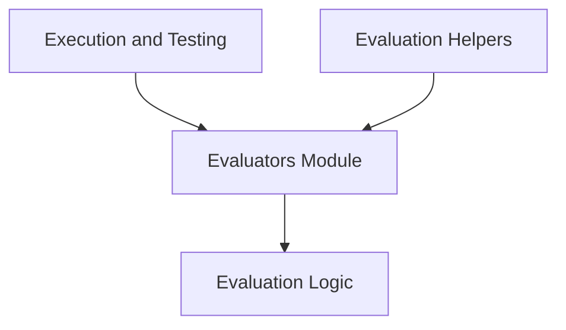

# Evaluators Module

## Introduction
The `evaluators` module is a critical component of the evaluation harness, providing the core logic for assessing the correctness and quality of agent actions and generated outputs. It defines various evaluation strategies, ranging from precise numerical comparisons to more nuanced string-based evaluations using metrics like ROUGE. This module ensures that agent trajectories can be systematically judged against predefined criteria, facilitating robust testing and performance measurement.

## Architecture Overview
The `evaluators` module integrates with the broader system by receiving outputs from the [execution_and_testing](execution_and_testing.md) module and potentially utilizing [evaluation_helpers](evaluation_helpers.md) for data retrieval or processing. Its primary responsibility is to delegate evaluation tasks to specialized sub-modules, such as the [evaluation_logic](evaluation_logic.md), which encapsulates the actual comparison algorithms.

<!-- DIAGRAM_JSON
{
    "direction": "TD",
    "nodes": [
        {"id": "execution_and_testing", "label": "Execution and Testing", "type": "module", "link": "execution_and_testing.md"},
        {"id": "evaluation_helpers", "label": "Evaluation Helpers", "type": "module", "link": "evaluation_helpers.md"},
        {"id": "evaluators", "label": "Evaluators Module", "type": "module"},
        {"id": "evaluation_logic", "label": "Evaluation Logic", "type": "module", "link": "evaluation_logic.md"}
    ],
    "edges": [
        {"source": "execution_and_testing", "target": "evaluators"},
        {"source": "evaluation_helpers", "target": "evaluators"},
        {"source": "evaluators", "target": "evaluation_logic"}
    ],
    "groups": []
}
-->

## Sub-modules

### Evaluation Logic
The `evaluation_logic` sub-module houses the concrete implementations of various evaluation strategies. It includes components like `NumericEvaluator` for comparing numerical values and `StringSoftEvaluator` for assessing text generation quality using metrics such as ROUGE. This sub-module is central to determining the success or failure of an agent's actions based on predefined criteria. For more details, refer to the [evaluation_logic.md](evaluation_logic.md) documentation.
