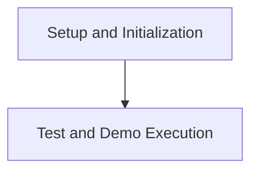

# Execution and Testing Module

## Introduction

The `execution_and_testing` module is responsible for orchestrating the running of tests and demos for the agent, managing the environment, agent interactions, and result logging. It provides the core framework for evaluating agent performance and demonstrating its capabilities.

## Architecture Overview

The module is structured into two main sub-modules: `setup_and_initialization` and `test_execution`. These sub-modules handle the preparatory steps and the actual execution logic, respectively.

<!-- DIAGRAM_JSON
{
    "direction": "TD",
    "nodes": [
        {"id": "setup_and_initialization", "label": "Setup and Initialization", "type": "module", "link": "setup_and_initialization.md"},
        {"id": "test_execution", "label": "Test and Demo Execution", "type": "module", "link": "test_execution.md"}
    ],
    "edges": [
        {"source": "setup_and_initialization", "target": "test_execution"}
    ],
    "groups": []
}
-->

## Sub-modules

### [Setup and Initialization](setup_and_initialization.md)
This sub-module is responsible for preparing the environment and setting up directories for logging and results before any tests or demos are run. It ensures that the system is in a ready state for execution.

### [Test and Demo Execution](test_execution.md)
This sub-module contains the core logic for running both comprehensive tests and interactive demonstrations. It handles the agent's interaction with the browser environment, processes actions, manages trajectories, and evaluates the outcomes, including search-based action selection and scoring.

