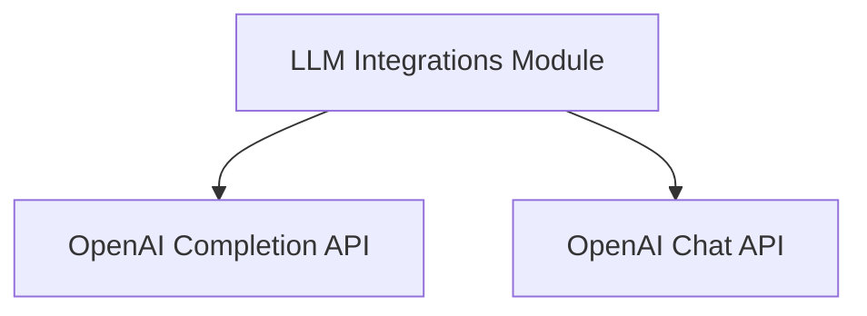

# LLM Integrations Module

The `llm_integrations` module provides a standardized interface for interacting with various Large Language Models (LLMs), specifically focusing on OpenAI's completion and chat completion APIs. Its primary purpose is to abstract away the complexities of API calls, rate limiting, and response parsing, allowing other modules to seamlessly integrate LLM capabilities.

## Architecture Overview

The module is structured into two main sub-modules, each dedicated to a specific type of OpenAI API interaction. This separation ensures clarity, maintainability, and scalability for different LLM functionalities.

<!-- DIAGRAM_JSON
{
    "direction": "TD",
    "nodes": [
        {"id": "openai_completion_api", "label": "OpenAI Completion API", "type": "module", "link": "openai_completion_api.md"},
        {"id": "openai_chat_api", "label": "OpenAI Chat API", "type": "module", "link": "openai_chat_api.md"}
    ],
    "edges": [
        {"source": "llm_integrations", "target": "openai_completion_api"},
        {"source": "llm_integrations", "target": "openai_chat_api"}
    ],
    "groups": []
}
-->

## Sub-modules

### [OpenAI Completion API](openai_completion_api.md)
This sub-module is responsible for handling asynchronous text generation requests to the OpenAI Completion API. It includes functionalities for setting parameters like temperature, max tokens, and managing rate limits.

### [OpenAI Chat API](openai_chat_api.md)
This sub-module facilitates asynchronous interactions with the OpenAI Chat Completion API. It manages the formatting of message lists, handles API calls, and processes responses for chat-based LLM interactions.
