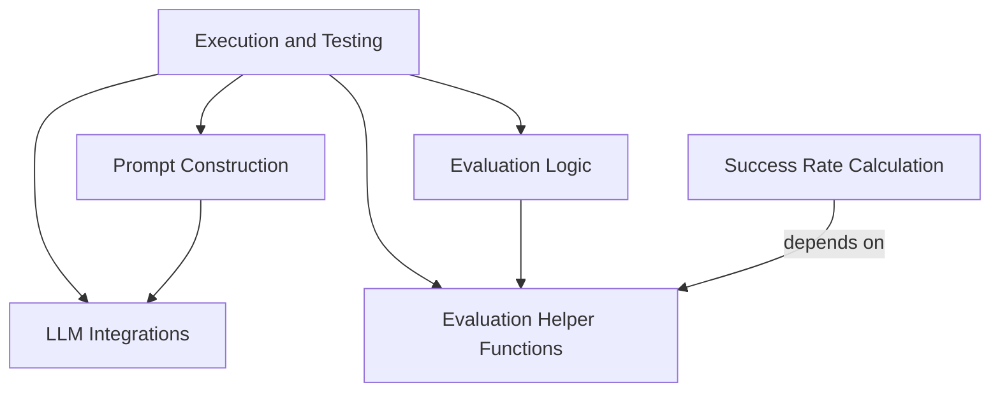

# Main Module Documentation

## Introduction
The `main` module serves as the orchestrator for running tests and demonstrations of an agent, encompassing various critical functionalities from environment setup and action execution to prompt construction and evaluation. It integrates with language models, utilizes helper functions for specific web interactions, and provides tools for analyzing performance metrics.

## Architecture
The `main` module is composed of several key sub-modules that interact to facilitate the end-to-end testing and demonstration workflow. The diagram below illustrates these components and their primary dependencies.

<!-- DIAGRAM_JSON
{
    "direction": "TD",
    "nodes": [
        {"id": "execution_and_testing", "label": "Execution and Testing", "type": "module", "link": "execution_and_testing.md"},
        {"id": "prompt_construction", "label": "Prompt Construction", "type": "module", "link": "prompt_construction.md"},
        {"id": "evaluation_helpers", "label": "Evaluation Helper Functions", "type": "module", "link": "evaluation_helpers.md"},
        {"id": "evaluators", "label": "Evaluation Logic", "type": "module", "link": "evaluators.md"},
        {"id": "llm_integrations", "label": "LLM Integrations", "type": "module", "link": "llm_integrations.md"},
        {"id": "success_rate_calculation", "label": "Success Rate Calculation", "type": "module", "link": "success_rate_calculation.md"}
    ],
    "edges": [
        {"source": "execution_and_testing", "target": "prompt_construction"},
        {"source": "execution_and_testing", "target": "evaluation_helpers"},
        {"source": "execution_and_testing", "target": "evaluators"},
        {"source": "execution_and_testing", "target": "llm_integrations"},
        {"source": "evaluators", "target": "evaluation_helpers"},
        {"source": "prompt_construction", "target": "llm_integrations"}
    ],
    "groups": []
}
-->

## Sub-modules Overview

*   **[Execution and Testing](execution_and_testing.md)**: This sub-module is responsible for orchestrating the agent's test runs and demonstrations. It handles the environment setup, agent initialization, action execution, and overall trajectory management, including early stopping mechanisms and result rendering.

*   **[Prompt Construction](prompt_construction.md)**: This sub-module provides the logic for dynamically constructing prompts for language models. It supports different prompting strategies, such as multimodal Chain-of-Thought (CoT) and direct prompting, tailoring the input to the specific LLM and task requirements.

*   **[Evaluation Helper Functions](evaluation_helpers.md)**: This sub-module offers a collection of utility functions designed to assist in the evaluation process. These helpers interact with various web platforms (e.g., Reddit, Shopping) to retrieve specific data points required for verifying agent actions and outcomes.

*   **[Evaluation Logic](evaluators.md)**: This sub-module defines various evaluators that assess the performance of the agent. It includes evaluators for numeric comparisons and string similarity, allowing for flexible and robust scoring of agent-generated responses against reference answers.

*   **[LLM Integrations](llm_integrations.md)**: This sub-module handles the asynchronous communication and integration with external Large Language Model providers, specifically focusing on OpenAI's completion and chat APIs. It manages API requests, rate limiting, and response parsing.

*   **[Success Rate Calculation](success_rate_calculation.md)**: This sub-module contains the script responsible for analyzing and calculating success rates from test logs. It provides detailed breakdowns of success rates based on different criteria, such as task achievability, website, and task type, offering insights into agent performance across various scenarios.
