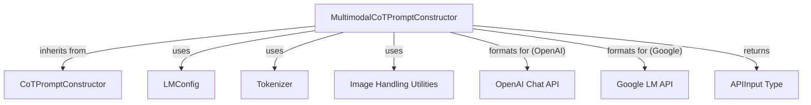

# Multimodal CoT Prompt Constructor

## Introduction

The `multimodal_cot_constructor` module provides the `MultimodalCoTPromptConstructor` class, which is responsible for generating prompts for Large Language Models (LLMs) that support multimodal inputs (text and images) and employ a Chain-of-Thought (CoT) reasoning approach. This module is crucial for preparing structured inputs that guide the LLM to perform step-by-step reasoning before producing an answer, enhancing the transparency and accuracy of LLM responses in complex tasks.

## Architecture and Component Relationships

The `MultimodalCoTPromptConstructor` class extends the base `CoTPromptConstructor` and integrates with various external components to assemble comprehensive prompts. It dynamically formats prompts based on the target LLM provider (e.g., OpenAI, Google) and handles the inclusion of visual information such as page screenshots and other relevant images.

<!-- DIAGRAM_JSON
{
    "direction": "TD",
    "nodes": [
        {"id": "multimodal_cot_constructor", "label": "MultimodalCoTPromptConstructor", "type": "component", "link": null},
        {"id": "cot_prompt_constructor", "label": "CoTPromptConstructor", "type": "component", "link": null},
        {"id": "lm_config", "label": "LMConfig", "type": "external", "link": "llm_integrations.md"},
        {"id": "tokenizer", "label": "Tokenizer", "type": "external", "link": "llm_integrations.md"},
        {"id": "image_handling", "label": "Image Handling Utilities", "type": "external", "link": "llm_integrations.md"},
        {"id": "openai_chat_api", "label": "OpenAI Chat API", "type": "external", "link": "openai_chat_api.md"},
        {"id": "google_lm_api", "label": "Google LM API", "type": "external", "link": "llm_integrations.md"},
        {"id": "api_input_type", "label": "APIInput Type", "type": "external", "link": "llm_integrations.md"}
    ],
    "edges": [
        {"source": "multimodal_cot_constructor", "target": "cot_prompt_constructor", "label": "inherits from"},
        {"source": "multimodal_cot_constructor", "target": "lm_config", "label": "uses"},
        {"source": "multimodal_cot_constructor", "target": "tokenizer", "label": "uses"},
        {"source": "multimodal_cot_constructor", "target": "image_handling", "label": "uses"},
        {"source": "multimodal_cot_constructor", "target": "openai_chat_api", "label": "formats for (OpenAI)"},
        {"source": "multimodal_cot_constructor", "target": "google_lm_api", "label": "formats for (Google)"},
        {"source": "multimodal_cot_constructor", "target": "api_input_type", "label": "returns"}
    ],
    "groups": []
}
-->

## Core Functionality

### `MultimodalCoTPromptConstructor` Class

**Purpose**: This class is designed to construct multimodal Chain-of-Thought prompts for various LLM providers. It takes into account textual observations, action history, and visual context (screenshots and additional images) to create a comprehensive input for the LLM.

**Key Methods**:

*   `__init__(self, instruction_path: str | Path, lm_config: lm_config.LMConfig, tokenizer: Tokenizer)`:
    *   Initializes the constructor with the path to instruction files, an LLM configuration object, and a tokenizer. It also extracts the `answer_phrase` from the instruction metadata.
*   `construct(self, trajectory: Trajectory, intent: str, page_screenshot_img: Image.Image, images: list[Image.Image], meta_data: dict[str, Any] = {}) -> APIInput`:
    *   The primary method for constructing the multimodal prompt.
    *   It retrieves introductory text, examples, and templates from the instruction file.
    *   Processes the latest observation from the `trajectory`, truncating it if `max_obs_length` is specified in `lm_config`.
    *   Formats the current prompt using the provided `objective`, `url`, `observation`, and `previous_action`.
    *   Calls `get_lm_api_input` to convert the structured information into an API-specific format.
*   `get_lm_api_input(self, intro: str, examples: list[tuple[str, str, str]], current: str, page_screenshot_img: Image.Image, images: list[Image.Image]) -> APIInput`:
    *   This method handles the LLM provider-specific formatting of the prompt.
    *   **OpenAI Integration**: If the `lm_config.provider` is "openai" and `lm_config.mode` is "chat", it constructs a chat-based message list, embedding images as base64 strings using `pil_to_b64`. It currently raises an error for other OpenAI modes.
    *   **Google Integration**: If the `lm_config.provider` is "google" and `lm_config.mode` is "completion", it constructs a completion-based prompt, embedding images using `pil_to_vertex`. It currently raises an error for other Google modes.
    *   Raises `NotImplementedError` for unsupported LLM providers.

## Integration with the Overall System

This `multimodal_cot_constructor` module is a vital part of the [prompt_construction.md](prompt_construction.md) system, specifically designed for agents requiring advanced reasoning capabilities. It acts as an intermediary between the agent's current state (trajectory, intent, observations) and the multimodal LLMs. By abstracting the complexities of prompt formatting for different LLM providers and incorporating both textual and visual information, it enables the agent to effectively leverage multimodal LLMs for complex tasks requiring step-by-step reasoning.

It depends on configuration from [llm_integrations.md](llm_integrations.md) for specifying the LLM provider and model. The generated `APIInput` is then consumed by the respective LLM integration modules, such as [openai_chat_api.md](openai_chat_api.md) or general functions within [llm_integrations.md](llm_integrations.md) for Google models, to send requests to the actual LLM APIs.