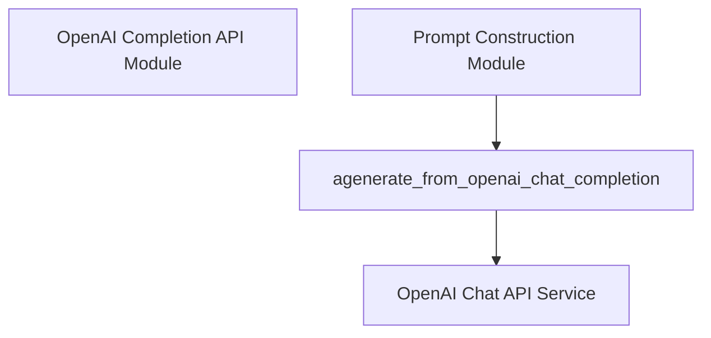

# openai_chat_api Module Documentation

The `openai_chat_api` module provides core functionality for integrating with the OpenAI Chat Completion API. It enables the system to generate text responses asynchronously using OpenAI's advanced chat models.

### Purpose and Core Functionality

The primary purpose of this module is to encapsulate the logic for making requests to the OpenAI Chat Completion API. Its core functionality is exposed through the `agenerate_from_openai_chat_completion` function. This function is designed to handle multiple asynchronous requests to the API, incorporating rate limiting to comply with API usage policies. It also performs essential checks, such as verifying the presence of the `OPENAI_API_KEY` environment variable, which is crucial for authenticating requests to OpenAI services. The function processes lists of messages, sends them to the specified OpenAI model, and extracts the generated content from the API responses.

Key features include:
-   **Asynchronous Generation**: Efficiently handles multiple concurrent requests to the OpenAI Chat API.
-   **Rate Limiting**: Utilizes `aiolimiter` to manage the rate of requests, preventing API abuse and ensuring stability.
-   **API Key Validation**: Ensures the necessary `OPENAI_API_KEY` is set before making any API calls.
-   **Response Parsing**: Extracts the generated text content from the OpenAI API's structured responses.

### Architecture and Component Relationships

The `openai_chat_api` module primarily consists of the `agenerate_from_openai_chat_completion` function. This function internally orchestrates calls to a throttled OpenAI chat completion client (likely `_throttled_openai_chat_completion_acreate`, which is an internal helper within the `openai_utils` package) to perform the actual API interactions. It depends on external libraries like `os` for environment variable access and `aiolimiter` for rate limiting. The module's interaction with the OpenAI Chat API is its most significant external dependency, sending prompts and receiving generated text.

<!-- DIAGRAM_JSON
{
    "direction": "TD",
    "nodes": [
        {"id": "agenerate_chat", "label": "agenerate_from_openai_chat_completion", "type": "component", "link": null},
        {"id": "openai_api", "label": "OpenAI Chat API Service", "type": "external", "link": null},
        {"id": "openai_completion_api_module", "label": "OpenAI Completion API Module", "type": "external", "link": "openai_completion_api.md"},
        {"id": "prompt_construction_module", "label": "Prompt Construction Module", "type": "external", "link": "prompt_construction.md"}
    ],
    "edges": [
        {"source": "agenerate_chat", "target": "openai_api"},
        {"source": "prompt_construction_module", "target": "agenerate_chat"}
    ],
    "groups": []
}
-->

### How the Module Fits into the Overall System

The `openai_chat_api` module is a vital part of the `llm_integrations` subsystem, residing within `llms.providers.openai_utils`.

It plays a crucial role for:
-   **Prompt Construction**: Modules like [prompt_construction.md](prompt_construction.md) can utilize this API to send constructed chat prompts (e.g., from `MultimodalCoTPromptConstructor` or `DirectPromptConstructor`) to OpenAI and receive model-generated responses.
-   **Evaluation**: If the system's evaluation processes involve generating responses via chat models, the `evaluation_harness` components might directly or indirectly depend on this module.
-   **Comparison with other LLM Integrations**: It stands alongside modules like [openai_completion_api.md](openai_completion_api.md), offering a specialized interface for chat-oriented models as opposed to completion-oriented ones. This modular separation allows the system to flexibly use different OpenAI capabilities based on specific task requirements.

By providing a robust and rate-limited interface to the OpenAI Chat API, this module enables other parts of the system to leverage advanced conversational AI capabilities without needing to manage the complexities of API interaction and throttling directly.