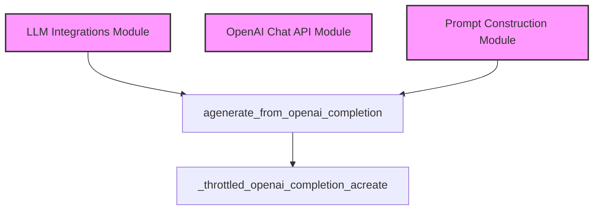

# Module: `openai_completion_api`

## Introduction
The `openai_completion_api` module serves as a crucial interface for interacting with the OpenAI Completion API. It provides asynchronous functionality to generate text based on given prompts, handling aspects like rate limiting and environment variable checks. This module is a core part of the system's ability to leverage large language models for various text generation tasks.

## Architecture and Component Relationships

This module primarily exposes one asynchronous function, `agenerate_from_openai_completion`, which orchestrates the calls to the OpenAI Completion API. It handles the necessary setup, including API key validation and request throttling, to ensure efficient and compliant interactions with the external service.

<!-- DIAGRAM_JSON
{
    "direction": "TD",
    "nodes": [
        {"id": "agenerate_from_openai_completion", "label": "agenerate_from_openai_completion", "type": "component", "link": null},
        {"id": "_throttled_openai_completion_acreate", "label": "_throttled_openai_completion_acreate", "type": "component", "link": null},
        {"id": "llm_integrations", "label": "LLM Integrations Module", "type": "external", "link": "llm_integrations.md"},
        {"id": "openai_chat_api", "label": "OpenAI Chat API Module", "type": "external", "link": "openai_chat_api.md"},
        {"id": "prompt_construction", "label": "Prompt Construction Module", "type": "external", "link": "prompt_construction.md"}
    ],
    "edges": [
        {"source": "agenerate_from_openai_completion", "target": "_throttled_openai_completion_acreate"},
        {"source": "llm_integrations", "target": "agenerate_from_openai_completion"},
        {"source": "prompt_construction", "target": "agenerate_from_openai_completion"}
    ],
    "groups": []
}
-->

### Components

#### `agenerate_from_openai_completion`

This is the primary asynchronous function for generating text using the OpenAI Completion API.

**Core Functionality:**
*   Takes a list of prompts, engine (model), temperature, max tokens, top-p, context length, and requests per minute.
*   Ensures the `OPENAI_API_KEY` environment variable is set.
*   Applies rate limiting using `aiolimiter` to manage API call frequency.
*   Asynchronously calls an internal helper function `_throttled_openai_completion_acreate` for each prompt.
*   Aggregates and returns the generated responses.

**Dependencies:**
*   **Internal:** `_throttled_openai_completion_acreate` (an internal utility function within the same `openai_utils.py` file).
*   **External Libraries:** `os` (for environment variables), `aiolimiter` (for asynchronous rate limiting), `tqdm_asyncio` (for asynchronous progress bar and gathering results).

## System Integration

The `openai_completion_api` module is a specialized part of the larger [llm_integrations.md](llm_integrations.md) system, which centralizes all interactions with Language Model APIs. It provides a direct pathway for components needing to utilize the OpenAI Completion API specifically.

Prompts are typically prepared by modules within the [prompt_construction.md](prompt_construction.md) category before being passed to `agenerate_from_openai_completion`. This module's output, the generated text, can then be consumed by various parts of the system, such as [evaluators.md](evaluators.md) or other processing units.

It operates alongside its sibling module, [openai_chat_api.md](openai_chat_api.md), which handles interactions with the OpenAI Chat Completion API, offering distinct but complementary LLM capabilities. This separation allows the system to choose the appropriate OpenAI API based on the specific generation task.
