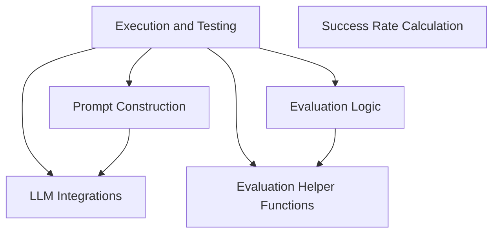

The `search-agents` repository provides a comprehensive framework for developing, testing, and evaluating search-based agents. It orchestrates the entire lifecycle from environment setup and agent action execution to prompt construction for Large Language Models (LLMs) and detailed performance evaluation. The repository integrates with various web platforms for data extraction and offers tools for analyzing agent success rates across different scenarios.

### Architecture Diagram

