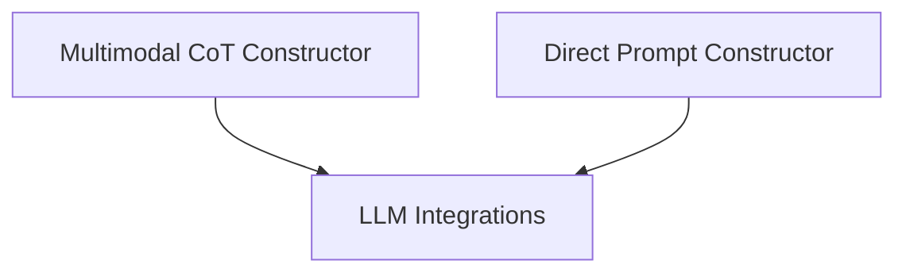

# Prompt Construction Module

## Introduction
The `prompt_construction` module is responsible for dynamically generating prompts that guide language models (LMs) in their reasoning and action-taking processes. It provides different strategies for constructing prompts based on the agent's intent, trajectory, and available data modalities, such as text and images.

## Architecture
The module is composed of specialized prompt constructors, each designed for a specific prompting paradigm. The architecture allows for flexible integration with various language models and supports different levels of reasoning complexity.

<!-- DIAGRAM_JSON
{
    "direction": "TD",
    "nodes": [
        {"id": "multimodal_cot_constructor", "label": "Multimodal CoT Constructor", "type": "module", "link": "multimodal_cot_constructor.md"},
        {"id": "direct_prompt_constructor", "label": "Direct Prompt Constructor", "type": "module", "link": "direct_prompt_constructor.md"}
    ],
    "edges": [
        {"source": "multimodal_cot_constructor", "target": "llm_integrations"},
        {"source": "direct_prompt_constructor", "target": "llm_integrations"}
    ],
    "groups": []
}
-->

## Sub-modules

### [Multimodal CoT Constructor](multimodal_cot_constructor.md)
This sub-module, implemented by `MultimodalCoTPromptConstructor`, focuses on constructing prompts that enable Chain-of-Thought (CoT) reasoning in multimodal contexts. It integrates text observations, previous actions, and image inputs (screenshots, additional images) to generate comprehensive prompts for advanced language models, especially those capable of processing visual information. It handles the specific formatting requirements for different LLM providers like OpenAI and Google.

### [Direct Prompt Constructor](direct_prompt_constructor.md)
This sub-module, embodied by `DirectPromptConstructor`, is responsible for creating straightforward, direct prompts for language models. Unlike the CoT constructor, it aims for a direct prediction of the action based on textual observations and the current state, without explicitly guiding the model through step-by-step reasoning in the prompt itself. It also includes logic for extracting actions from the LM's response.
