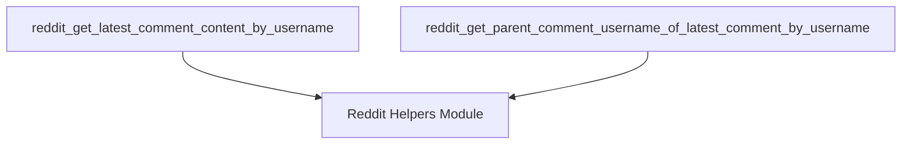

# reddit_comment_data_extraction Module Documentation

## Introduction
The `reddit_comment_data_extraction` module is responsible for extracting specific data from Reddit comments, primarily focusing on retrieving the content of the latest comment by a given user and the username of its parent comment. It provides helper functions to facilitate the evaluation process by fetching relevant Reddit data.

## Core Functionality
This module offers two main functions to interact with Reddit comment data:
-   `reddit_get_latest_comment_content_by_username`: Retrieves the textual content of the most recent comment posted by a specified Reddit username.
-   `reddit_get_parent_comment_username_of_latest_comment_by_username`: Fetches the username of the parent comment for the latest comment made by a given user.

These functions are designed to safely handle cases where the requested information might not be available, returning an empty string in such scenarios.

## Architecture and Component Relationships

The `reddit_comment_data_extraction` module is a leaf module within the broader [reddit_helpers](reddit_helpers.md) module, which is part of [evaluation_helpers](evaluation_helpers.md). It encapsulates specific data extraction logic for Reddit comments.

<!-- DIAGRAM_JSON
{
    "direction": "TD",
    "nodes": [
        {"id": "get_content", "label": "reddit_get_latest_comment_content_by_username", "type": "component", "link": null},
        {"id": "get_parent_username", "label": "reddit_get_parent_comment_username_of_latest_comment_by_username", "type": "component", "link": null},
        {"id": "reddit_helpers", "label": "Reddit Helpers Module", "type": "external", "link": "reddit_helpers.md"}
    ],
    "edges": [
        {"source": "get_content", "target": "reddit_helpers"},
        {"source": "get_parent_username", "target": "reddit_helpers"}
    ],
    "groups": []
}
-->


### Component Breakdown:

*   **`reddit_get_latest_comment_content_by_username`**: This function takes a page object and a username, then attempts to retrieve the latest comment object for that user and extract its content. It depends on internal helper functions (likely from the `reddit_helpers` module) to get the comment object.
*   **`reddit_get_parent_comment_username_of_latest_comment_by_username`**: Similar to the above, this function takes a page object and a username, retrieves the parent comment object of the latest comment, and then extracts the parent's username. It also relies on internal helper functions to obtain the comment object.

## How the Module Fits into the Overall System
This module serves as a specialized data accessor for Reddit-specific information required by the evaluation harness. It provides granular functions that allow other parts of the system, particularly the evaluation logic within the [evaluation_helpers](evaluation_helpers.md) and [reddit_helpers](reddit_helpers.md) modules, to programmatically fetch Reddit comment details without needing to directly interact with the page parsing or scraping logic. By centralizing these helper functions, it ensures consistent and robust data extraction for evaluation purposes.

## Core Components

### `evaluation_harness.helper_functions.reddit_get_latest_comment_content_by_username`
```python
def reddit_get_latest_comment_content_by_username(
    page: Page | PseudoPage, username: str
) -> str:
    try:
        comment = reddit_get_latest_comment_obj_by_username(page, username)
        content = comment["content"]

    except Exception:
        content = ""

    return content
```
This function retrieves the content of the latest Reddit comment made by a specified `username` on a given `page`. It uses an internal helper `reddit_get_latest_comment_obj_by_username` to get the comment object and then extracts its content. If any error occurs during the process, an empty string is returned.

### `evaluation_harness.helper_functions.reddit_get_parent_comment_username_of_latest_comment_by_username`
```python
def reddit_get_parent_comment_username_of_latest_comment_by_username(
    page: Page | PseudoPage, username: str
) -> str:
    try:
        comment = reddit_get_parent_comment_obj_of_latest_comment_by_username(
            page, username
        )
        username = comment["username"]

    except Exception:
        username = ""

    return username
```
This function fetches the username of the parent comment for the latest comment made by a given `username` on a specified `page`. It relies on the `reddit_get_parent_comment_obj_of_latest_comment_by_username` helper to obtain the parent comment object and then extracts the parent's `username`. It returns an empty string if an error occurs.
