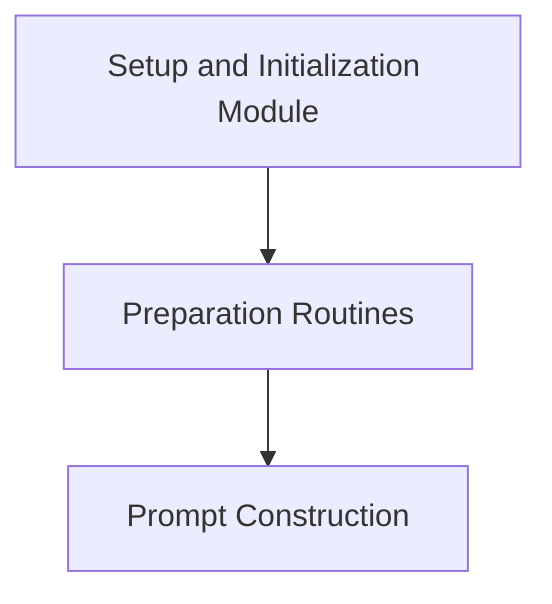

# Setup and Initialization Module

This module is responsible for the initial setup and preparation steps required before executing tests or demonstrations. It ensures that the environment, such as necessary directories and converted prompt files, is correctly configured for the subsequent execution phases.

## Architecture Overview

The `setup_and_initialization` module is a child of the `execution_and_testing` module. Its primary role is to prepare the environment for both test and demo runs. It interacts with the `prompt_construction` module to convert prompt files and manages the creation of result directories.

<!-- DIAGRAM_JSON
{
    "direction": "TD",
    "nodes": [
        {"id": "setup_and_initialization_module", "label": "Setup and Initialization Module", "type": "module"},
        {"id": "preparation_routines", "label": "Preparation Routines", "type": "module", "link": "preparation_routines.md"},
        {"id": "prompt_construction", "label": "Prompt Construction", "type": "module", "link": "prompt_construction.md"}
    ],
    "edges": [
        {"source": "setup_and_initialization_module", "target": "preparation_routines"},
        {"source": "preparation_routines", "target": "prompt_construction"}
    ],
    "groups": []
}
-->

## Sub-modules

### [Preparation Routines](preparation_routines.md)
This sub-module encapsulates the core logic for setting up the execution environment, including directory creation and prompt file conversion. It ensures that all prerequisites are met before tests or demos commence.