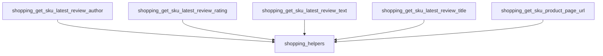

The `shopping_review_helpers` module is a vital component within the `evaluation_harness.helper_functions` ecosystem, specifically designed to interact with a shopping administration API. Its primary purpose is to retrieve detailed review-related information and product page URLs for given SKUs, facilitating evaluation tasks that require insights into customer feedback and product accessibility.

### Purpose and Core Functionality

The `shopping_review_helpers` module provides a set of utility functions to query a shopping API for specific product review data and product page URLs. These functions are crucial for automated evaluation processes where the system needs to verify customer reviews, ratings, and quickly access product information based on a Stock Keeping Unit (SKU).

The core functionalities include:

*   **Retrieving Review Author**: Fetching the nickname of the author who submitted the latest review for a product.
*   **Retrieving Review Rating**: Obtaining the numerical rating of the latest review.
*   **Retrieving Review Text**: Extracting the detailed textual content of the latest product review.
*   **Retrieving Review Title**: Getting the title associated with the latest product review.
*   **Retrieving Product Page URL**: Generating the direct URL to a product's page using its SKU.

Each function communicates with a REST API endpoint, authenticating requests using a bearer token, and then parsing the JSON response to extract the required information.

### Architecture and Component Relationships

The `shopping_review_helpers` module consists of several closely related functions, each dedicated to fetching a specific piece of information. These functions share a common pattern of API interaction, including authentication and error handling (asserting a 200 status code). They are logically grouped due to their shared domain of "shopping review" data and their reliance on a common authentication mechanism provided by the broader `shopping_helpers` module.

<!-- DIAGRAM_JSON
{
    "direction": "TD",
    "nodes": [
        {"id": "get_sku_latest_review_author", "label": "shopping_get_sku_latest_review_author", "type": "component", "link": null},
        {"id": "get_sku_latest_review_rating", "label": "shopping_get_sku_latest_review_rating", "type": "component", "link": null},
        {"id": "get_sku_latest_review_text", "label": "shopping_get_sku_latest_review_text", "type": "component", "link": null},
        {"id": "get_sku_latest_review_title", "label": "shopping_get_sku_latest_review_title", "type": "component", "link": null},
        {"id": "get_sku_product_page_url", "label": "shopping_get_sku_product_page_url", "type": "component", "link": null},
        {"id": "shopping_helpers_module", "label": "shopping_helpers", "type": "external", "link": "shopping_helpers.md"}
    ],
    "edges": [
        {"source": "get_sku_latest_review_author", "target": "shopping_helpers_module"},
        {"source": "get_sku_latest_review_rating", "target": "shopping_helpers_module"},
        {"source": "get_sku_latest_review_text", "target": "shopping_helpers_module"},
        {"source": "get_sku_latest_review_title", "target": "shopping_helpers_module"},
        {"source": "get_sku_product_page_url", "target": "shopping_helpers_module"}
    ],
    "groups": []
}
-->

### How the Module Fits into the Overall System

The `shopping_review_helpers` module is a sub-module of `shopping_helpers`, which itself is part of the larger `evaluation_helpers`. This placement indicates its role in providing specific data retrieval capabilities for the `evaluation_harness`.

It acts as a data provider for evaluation logic that might need to assess the quality of product reviews, verify product information, or simulate user interactions that involve checking product details and reviews. For example, an evaluator might use `shopping_get_sku_latest_review_rating` to determine if a product meets a certain quality threshold based on customer feedback.

This module's functions are called by higher-level evaluation components or test scripts that require dynamic access to shopping review and product page data. It abstracts the complexities of API interaction, providing a clean interface for fetching specific data points, thus promoting modularity and reusability within the `evaluation_harness`.

For more general shopping-related helper functions, refer to the [shopping_helpers.md](shopping_helpers.md) documentation.
For the overall evaluation helper functions, refer to the [evaluation_helpers.md](evaluation_helpers.md) documentation.
For how these helpers are used in evaluation logic, refer to the [evaluation_logic.md](evaluation_logic.md) documentation.