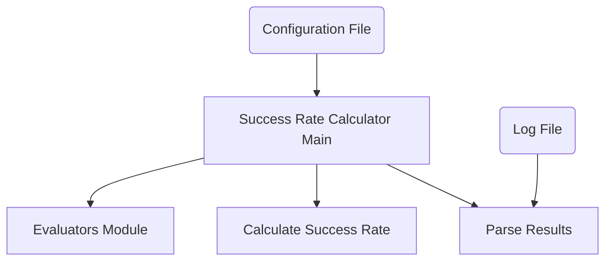

The `success_rate_calculation` module is responsible for analyzing and reporting the success rates of various tasks. It provides a comprehensive breakdown of success rates based on different criteria, including overall performance, achievability, website specificity, and task type. This module is crucial for evaluating the performance of the system and identifying areas for improvement.

### Architecture

The `success_rate_calculation` module's primary component is `scripts.calc_breakdown_sr.main`. This script orchestrates the entire success rate calculation process by reading task configurations and log files, then categorizing and calculating success rates across various dimensions. It relies on internal helper functions for parsing results and calculating individual success rates.

<!-- DIAGRAM_JSON
{
    "direction": "TD",
    "nodes": [
        {"id": "main_sr_calc", "label": "Success Rate Calculator Main", "type": "component", "link": null},
        {"id": "parse_results_func", "label": "Parse Results", "type": "component", "link": null},
        {"id": "calc_sr_func", "label": "Calculate Success Rate", "type": "component", "link": null},
        {"id": "config_file", "label": "Configuration File", "type": "external", "link": null},
        {"id": "log_file", "label": "Log File", "type": "external", "link": null},
        {"id": "evaluators_module", "label": "Evaluators Module", "type": "external", "link": "evaluators.md"}
    ],
    "edges": [
        {"source": "main_sr_calc", "target": "parse_results_func"},
        {"source": "main_sr_calc", "target": "calc_sr_func"},
        {"source": "config_file", "target": "main_sr_calc"},
        {"source": "log_file", "target": "parse_results_func"},
        {"source": "main_sr_calc", "target": "evaluators_module"}
    ],
    "groups": []
}
-->

### Component Breakdown

#### `scripts.calc_breakdown_sr.main`

This is the primary entry point for success rate calculations. It performs the following key functions:

1.  **Input Parsing**: Reads `id_to_success` data from a specified log file using an internal `parse_result` function and loads task configurations from a JSON file.
2.  **Overall Success Rate**: Calculates the overall success rate across all tasks.
3.  **Achievability Analysis**: Categorizes tasks as "achievable" or "unachievable" based on their evaluation types and reference answers (specifically looking for `string_match` evaluations with "N/A" for `fuzzy_match` reference answers). It then calculates separate success rates for each category. This categorization relies on the understanding of evaluation types defined in the [evaluators module](evaluators.md).
4.  **Website-Specific Success Rate**: Groups tasks by the websites they interact with (e.g., "shopping", "reddit", "wikipedia") and calculates the success rate for each website.
5.  **Task Type Success Rate**: Classifies tasks into types like "info_seeking" (string_match), "site_nav" (url_match), and "content_config" (other evaluation types). It then computes the success rate for each task type, again leveraging the definitions within the [evaluators module](evaluators.md).
6.  **Reporting**: Prints a detailed breakdown of all calculated success rates to the console.

The `main` function utilizes helper functions like `parse_result` and `calc_sr` (assumed to be internal to `scripts.calc_breakdown_sr.py` or closely related). `parse_result` would be responsible for converting the log file content into a usable `id_to_success` mapping, and `calc_sr` would compute the success rate from such a mapping.

### Relationships with Other Modules

*   **[evaluators.md](evaluators.md)**: The `success_rate_calculation` module relies on the concepts and definitions within the `evaluators` module, particularly the `eval_types` (e.g., `string_match`, `url_match`) when categorizing tasks and determining achievability. While it doesn't directly call evaluator functions, it interprets the evaluation configuration based on these types.
*   **[execution_and_testing.md](execution_and_testing.md)**: This module produces the log files that `success_rate_calculation` consumes. The results of test runs and action scoring, managed by `execution_and_testing`, are the primary data source for success rate analysis.

### How it Fits into the Overall System

The `success_rate_calculation` module serves as a critical analytical component in the broader system. After agents have executed tasks and their performance has been logged (potentially via `execution_and_testing`), this module processes those logs and configuration files to provide actionable insights into the system's effectiveness. It helps developers and stakeholders understand performance bottlenecks, identify areas where agents struggle, and track improvements over time by providing detailed success rate breakdowns. This analysis is vital for iterative development and refinement of the agent's capabilities.