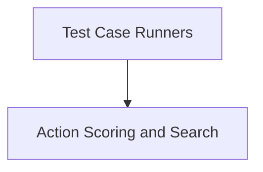

# Test Execution Module

The `test_execution` module is responsible for orchestrating the execution of automated tests and demonstrations within the system. It handles the core logic for running agents against various tasks, managing the environment, and evaluating their performance.

## Architecture Overview

The `test_execution` module is composed of several key sub-modules that work together to facilitate the testing process. The overall architecture is depicted in the diagram below:

<!-- DIAGRAM_JSON
{
    "direction": "TD",
    "nodes": [
        {"id": "test_runners", "label": "Test Case Runners", "type": "module", "link": "test_runners.md"},
        {"id": "action_scoring", "label": "Action Scoring and Search", "type": "module", "link": "action_scoring.md"}
    ],
    "edges": [
        {"source": "test_runners", "target": "action_scoring"}
    ],
    "groups": []
}
-->

## Sub-modules

### [Test Case Runners](test_runners.md)
This sub-module (`test_runners`) manages the overall flow of test execution for both standard test runs and interactive demonstrations. It initializes the environment, loads tasks, and controls the agent's interaction with the browser environment.

### [Action Scoring and Search](action_scoring.md)
This sub-module (`action_scoring`) provides the underlying mechanics for agents to take actions within the environment and evaluate their immediate impact. It is particularly crucial for search-based agents that explore multiple action paths to find an optimal sequence, assessing the success of each potential trajectory.