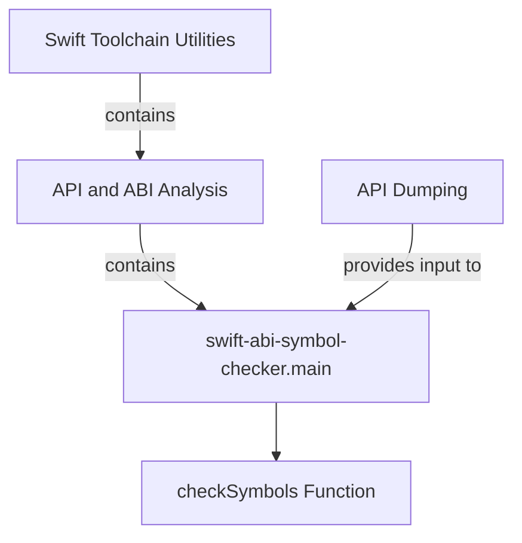

# `abi_symbol_checking` Module Documentation

The `abi_symbol_checking` module is a crucial component within the `swift_toolchain_utilities` responsible for verifying the Application Binary Interface (ABI) compatibility of Swift symbols. It provides a command-line utility to compare symbol files and detect changes that might impact ABI stability, which is vital for maintaining compatibility between different versions of Swift libraries and applications.

## Core Functionality

This module's primary function is to analyze changes in symbol definitions between different versions of a Swift module. It takes symbol information and change descriptions as input, allowing developers to identify potential ABI breaks early in the development cycle. This ensures that updates to a Swift toolchain or SDK do not inadvertently break existing applications linked against older versions.

The main entry point, `utils.swift-abi-symbol-checker.main`, parses command-line arguments specifying the `changes` file (describing modifications), the `symbols` file (containing symbol definitions), and an optional `base` changes file for comparison against a baseline. It then delegates the actual symbol checking logic to an internal `checkSymbols` function.

## Architecture and Component Relationships

The `abi_symbol_checking` module is a leaf module within the `api_and_abi_analysis` submodule, which itself is part of the broader `swift_toolchain_utilities`. It works in conjunction with other tools in this ecosystem, such as `api_dumping`, which might generate the symbol and change files that `abi_symbol_checking` consumes.

<!-- DIAGRAM_JSON
{
    "direction": "TD",
    "nodes": [
        {"id": "abi_symbol_checking_main", "label": "swift-abi-symbol-checker.main", "type": "component", "link": null},
        {"id": "check_symbols_func", "label": "checkSymbols Function", "type": "component", "link": null},
        {"id": "api_and_abi_analysis", "label": "API and ABI Analysis", "type": "external", "link": "api_and_abi_analysis.md"},
        {"id": "swift_toolchain_utilities", "label": "Swift Toolchain Utilities", "type": "external", "link": "swift_toolchain_utilities.md"},
        {"id": "api_dumping", "label": "API Dumping", "type": "external", "link": "api_dumping.md"}
    ],
    "edges": [
        {"source": "abi_symbol_checking_main", "target": "check_symbols_func"},
        {"source": "api_and_abi_analysis", "target": "abi_symbol_checking_main", "label": "contains"},
        {"source": "swift_toolchain_utilities", "target": "api_and_abi_analysis", "label": "contains"},
        {"source": "api_dumping", "target": "abi_symbol_checking_main", "label": "provides input to"}
    ],
    "groups": []
}
-->

## How it Fits into the Overall System

The `abi_symbol_checking` module plays a critical role in the Swift development ecosystem by enforcing ABI stability. It ensures that changes made to Swift compilers and standard libraries do not inadvertently introduce incompatibilities that would require recompilation of existing applications or libraries.

It serves as a quality assurance tool, often integrated into continuous integration (CI) pipelines, where it can automatically flag potential ABI breakage upon code changes. By linking to modules like [api_and_abi_analysis](api_and_abi_analysis.md) and [swift_toolchain_utilities](swift_toolchain_utilities.md), it contributes to a comprehensive set of tools for maintaining the long-term stability and compatibility of the Swift platform. The module may receive its input files (like `symbols` and `changes`) from tools such as those found in the [api_dumping](api_dumping.md) module, which are capable of extracting API and ABI information from Swift modules.