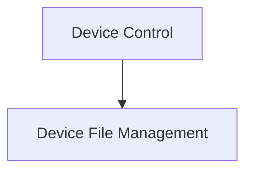

# adb_commands Module Documentation

## Introduction

The `adb_commands` module provides a set of essential utilities for interacting with Android devices via the Android Debug Bridge (ADB). It encapsulates common ADB operations, making it easier to perform tasks such as managing device files and controlling the device state.

## Architecture Overview

The `adb_commands` module is structured into logical sub-modules, each focusing on a specific category of ADB operations. This design promotes modularity and maintainability, allowing for clear separation of concerns.

<!-- DIAGRAM_JSON
{
    "direction": "TD",
    "nodes": [
        {"id": "device_control", "label": "Device Control", "type": "module", "link": "device_control.md"},
        {"id": "device_file_management", "label": "Device File Management", "type": "module", "link": "device_file_management.md"}
    ],
    "edges": [
        {"source": "device_control", "target": "device_file_management"}
    ],
    "groups": []
}
-->

## Sub-modules

### [Device Control](device_control.md)
This sub-module offers commands for controlling the state of connected Android devices, such as rebooting.

### [Device File Management](device_file_management.md)
This sub-module provides utilities for managing files and directories on connected Android devices.