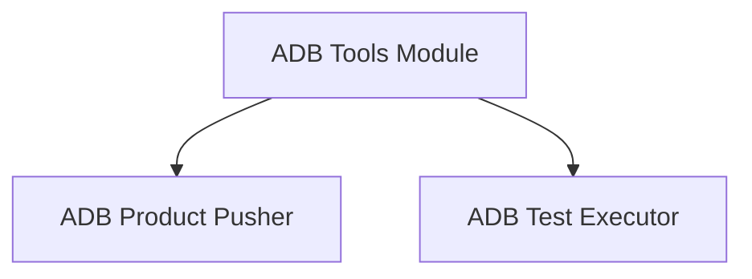

# ADB Tools Module Documentation

## Introduction

The `adb_tools` module provides essential utilities for interacting with Android devices via the Android Debug Bridge (ADB). It simplifies common tasks such as pushing built artifacts to a device and executing test programs directly on the device. This module is a child of the `android_utilities` module, focusing specifically on ADB-related operations.

## Architecture

The `adb_tools` module is composed of two primary sub-modules, each handling a distinct set of functionalities related to Android device interaction:

<!-- DIAGRAM_JSON
{
    "direction": "TD",
    "nodes": [
        {"id": "adb_product_pusher", "label": "ADB Product Pusher", "type": "module", "link": "adb_product_pusher.md"},
        {"id": "adb_test_executor", "label": "ADB Test Executor", "type": "module", "link": "adb_test_executor.md"}
    ],
    "edges": [
        {"source": "adb_tools", "target": "adb_product_pusher"},
        {"source": "adb_tools", "target": "adb_test_executor"}
    ],
    "groups": []
}
-->

## Sub-modules

### [ADB Product Pusher](adb_product_pusher.md)

This sub-module is responsible for pushing various built products, such as shared object files (`.so`) and NDK-specific libraries like `libc++_shared.so`, to a connected Android device. It automates the process of deploying necessary files for testing or application deployment.

### [ADB Test Executor](adb_test_executor.md)

The `adb_test_executor` sub-module facilitates the execution of programs on an Android device. It allows users to specify an executable path and pass arbitrary arguments, making it a flexible tool for running tests or other command-line utilities directly on the target device.
