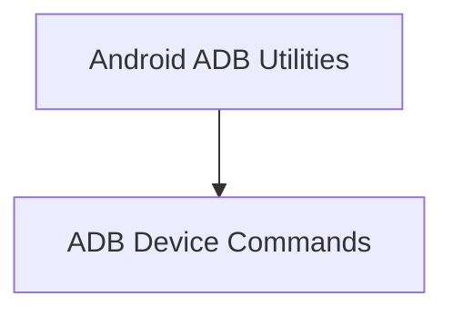

# Android Utilities Module

## Introduction
The `android_utilities` module provides a collection of essential tools and scripts designed to streamline interaction with Android devices through ADB (Android Debug Bridge). This module facilitates common development tasks such as managing device files, rebooting devices, deploying built applications, and executing tests directly on connected Android hardware.

## Architecture Overview
The `android_utilities` module is structured into two main sub-modules: `adb_commands` and `adb_tools`. The `adb_commands` sub-module encapsulates fundamental ADB operations, while `adb_tools` leverages these commands to provide higher-level functionalities like pushing artifacts and running tests.

<!-- DIAGRAM_JSON
{
    "direction": "TD",
    "nodes": [
        {"id": "adb_commands", "label": "ADB Device Commands", "type": "module", "link": "adb_commands.md"},
        {"id": "adb_tools", "label": "Android ADB Utilities", "type": "module", "link": "adb_tools.md"}
    ],
    "edges": [
        {"source": "adb_tools", "target": "adb_commands"}
    ],
    "groups": []
}
-->

## Sub-modules

*   **[ADB Device Commands](adb_commands.md)**: This sub-module contains basic ADB operations to manage the Android device directly, including commands for removing directories and rebooting the device.
*   **[Android ADB Utilities](adb_tools.md)**: This sub-module provides more advanced functionalities built upon the core ADB commands, enabling deployment of built products and execution of tests on Android devices.
