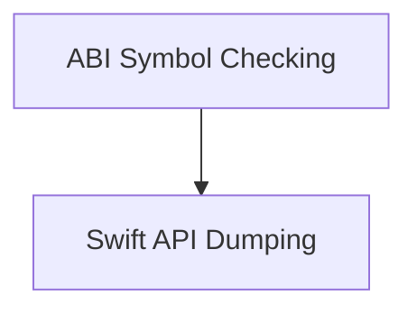

# API and ABI Analysis Module

## Introduction

The `api_and_abi_analysis` module provides tools for analyzing the Application Binary Interface (ABI) and Application Programming Interface (API) of Swift modules. This module is critical for ensuring compatibility, detecting breaking changes, and inspecting the public interfaces of Swift components within the larger swift_toolchain_utilities ecosystem.

## Architecture Overview

The `api_and_abi_analysis` module is composed of two primary sub-modules:
- **ABI Symbol Checking**: Focuses on analyzing and validating the ABI symbols of Swift modules.
- **Swift API Dumping**: Handles the generation of API dumps for Swift modules, providing a detailed view of their public interfaces.

These sub-modules work in conjunction to provide a comprehensive analysis framework for Swift's API and ABI. The module integrates with `swift-ide-test` for API dumping and uses custom logic for ABI symbol validation.

<!-- DIAGRAM_JSON
{
    "direction": "TD",
    "nodes": [
        {"id": "abi_symbol_checking", "label": "ABI Symbol Checking", "type": "module", "link": "abi_symbol_checking.md"},
        {"id": "api_dumping", "label": "Swift API Dumping", "type": "module", "link": "api_dumping.md"}
    ],
    "edges": [
        {"source": "abi_symbol_checking", "target": "api_dumping", "label": "uses"}
    ],
    "groups": []
}
-->

## Sub-modules

### [ABI Symbol Checking](abi_symbol_checking.md)
This sub-module is responsible for analyzing and checking ABI symbols in Swift modules. It uses `utils.swift-abi-symbol-checker.main` to process changes and symbols files, and to compare against a base changes file to identify ABI incompatibilities or changes.

### [Swift API Dumping](api_dumping.md)
This sub-module provides functionality to generate API dumps of Swift modules. It leverages `utils.swift-api-dump.main` which in turn uses `swift-ide-test` to print module interfaces. The `utils.swift-api-dump.dump_module_api_star` component is a helper function to facilitate multiprocessing for generating multiple API dumps efficiently.

## How the module fits into the overall system

The `api_and_abi_analysis` module is a crucial part of the `swift_toolchain_utilities`. It ensures the stability and compatibility of the Swift toolchain by providing mechanisms to analyze and validate both the binary and programmatic interfaces of Swift modules. This helps in preventing regressions and maintaining a consistent development experience across different versions and platforms. It also aids developers in understanding the evolution of Swift's public APIs and ABIs.